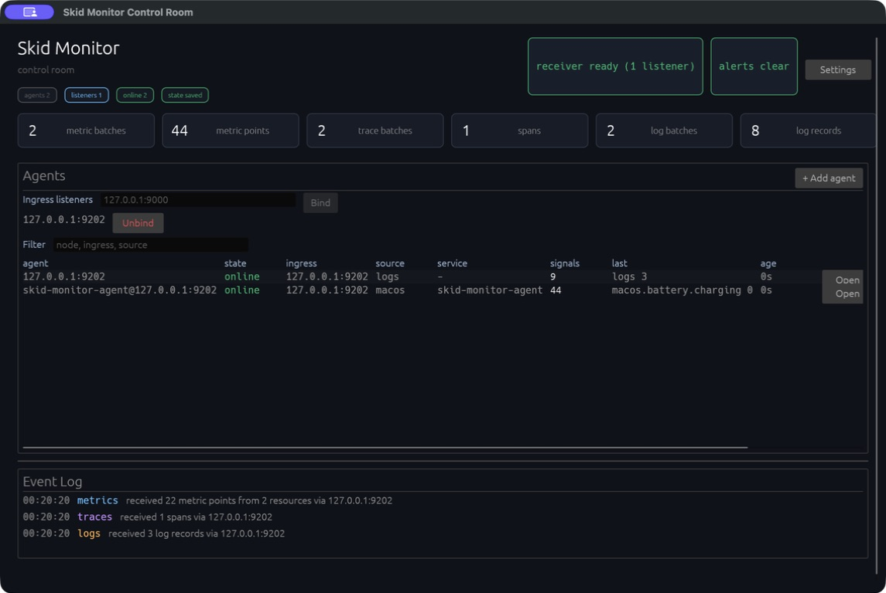
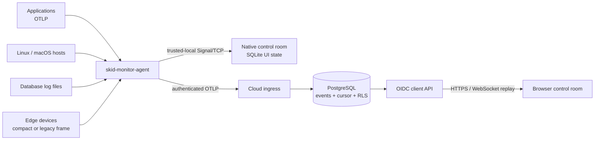

# Skid Monitor

**Skid Monitor is a Rust-based observability control plane that collects OTLP, host, database,
and edge signals into a unified local or cloud dashboard.**

개인 서버, 소규모 클러스터, edge 장비에서 나오는 서로 다른 신호를 하나의 가벼운 Rust 기반
control room에서 확인하기 위한 실험이다. Datadog이나 Grafana 같은 엔터프라이즈 관측 플랫폼을
대체하기보다, trusted-local 환경에서 빠르게 시작하고 필요할 때 PostgreSQL/OIDC cloud 경로로
확장하는 것을 목표로 한다.

## 지금 실행하면 무엇을 볼 수 있나

기본 native frontend는 agent가 보내는 metrics, traces, logs를 받아 다음 화면으로 정리한다.



_macOS arm64에서 native frontend와 agent를 함께 실행한 실제 Solo 화면(2026-07-19). 캡처에서는
다른 local process와의 port 충돌을 피하려고 `127.0.0.1:9202`를 사용했다._

```text
Skid Monitor control room
├── Agents overview    endpoint / node / source / service / counters / last seen
└── Per-agent detail
    ├── Nodes / Database Metrics / Trends
    ├── Latest Metrics
    └── Event Log      signal·receiver event와 deterministic alert
```

## 왜 Skid Monitor인가

애플리케이션 OTLP, OS별 host metric, database log, 작은 edge sensor는 수집 방식과 실행 환경이
다르다. Skid Monitor는 이 입력을 공통 `Signal` 계약으로 정규화해 같은 frontend와 cloud store에서
읽을 수 있게 한다.

Solo mode는 별도 backend 없이 loopback TCP로 agent와 native frontend를 직접 연결한다. Cloud mode는
agent ingress와 사용자 API를 분리하고, OIDC identity와 PostgreSQL tenant RLS를 적용한다. 두 경로는
같은 OTLP `Signal` 계약을 사용하며, Cloud 경로는 여기에 durable envelope, cursor, projection을 더한다.

## 핵심 기능

- OTLP gRPC metrics, logs, traces 수신과 pipeline fan-out
- Linux `/proc` 및 macOS native command 기반 host metrics
- PostgreSQL, MySQL, Redis, Valkey log file tail을 OTLP Logs로 변환
- trusted-local Solo mode와 PostgreSQL/OIDC 기반 Cloud mode
- 여러 ingress를 한 화면에 모으는 native/browser control-room frontend
- 별도 프로세스로 격리한 선택적 .NET extension host

## 5분 Quick Start

필요 조건은 Git, graphical desktop, **Rust 1.94 이상**이다. 현재 lockfile의 SQLx 0.9가 Rust 1.94를
요구한다. 먼저 frontend를 실행한다.

```sh
git clone https://github.com/LuticaCANARD/skid-monitor.git
cd skid-monitor
SKID_MONITOR_CLIENT_ADDR=127.0.0.1:9000 cargo run -p skid-monitor-fe
```

다른 terminal에서 agent를 실행한다.

```sh
cd skid-monitor
SKID_MONITOR_CLIENT_ADDR=127.0.0.1:9000 cargo run -p skid-monitor-agent
```

성공하면 `Ingress listeners`에 `127.0.0.1:9000`이 표시되고, `Agents` 표에 `macos` 또는 `system`
source의 행이 생긴다. 해당 행의 `Open`을 누르면 `Latest Metrics`에서 CPU·memory·load 등을 볼 수
있고, overview의 `last seen`이 약 15초마다 갱신된다. 종료할 때는 frontend 창을 닫고 agent
terminal에서 `Ctrl-C`를 누른다.

설치 전제, 상세 검증, 흔한 실패 원인은 [Getting Started](docs/getting-started.md)를 따른다.

## 기능 상태

상태는 네 단계만 사용한다: **Stable**은 기본 경로와 자동·실행 검증이 완료된 기능,
**Experimental**은 작동하지만 계약이 바뀔 수 있는 기능, **Prototype**은 제한된 시나리오만 구현된
기능, **Planned**는 설계 또는 RFC만 있는 기능이다. 현재 Stable로 선언한 기능은 없다.

| 기능 | 상태 | 현재 경계 |
| --- | --- | --- |
| Native Solo dashboard | Experimental | loopback TCP 수신, multi-listener, SQLite UI state |
| OTLP metrics/logs/traces ingestion | Experimental | agent gRPC receiver와 pipeline 구현 |
| Linux/macOS host metrics | Experimental | Linux parser tests, macOS arm64 runtime smoke |
| Database log receiver | Experimental | tail, truncate/rotation, partial/oversized line tests |
| PostgreSQL/OIDC Cloud mode | Experimental | split ingress/API, cursor replay, tenant RLS; 외부 DB 필요 |
| Edge collection | Prototype | compact wire adapter와 deterministic mock sender만 구현 |
| Alert/character presenter | Prototype | 고정 rule, 사용자 PNG/JPEG와 상태별 action; native high-spec은 VRM 0.x/1.0, MToon 전용 map, expression/SpringBone/lookAt/constraint, 다중 VRMA crossfade와 검증된 custom WGSL material hook |
| File transfer | Planned | root availability/count/bytes metadata만 전송 |
| Compute routing | Prototype | logical CPU와 placeholder score만 전송; 실행 기능 없음 |
| Windows sampler / Quantum adapter | Planned | RFC·enum 수준이며 runtime adapter 없음 |

검증 근거와 미구현 범위는 [Feature Status](docs/feature-status.md)가 정준 문서다.

## 현재 아키텍처



Solo 전송은 신호마다 새 TCP 연결을 열며 durable payload spool이 없다. Cloud 전송은 제한된 retry와
restart-safe sequence allocator를 사용하지만 역시 payload spool은 아니다. ordering, cursor,
중복 처리, 장애 시 손실 범위는 [Architecture](docs/architecture.md)에 설명한다.

## 설계 경계

- 기본 Solo listener와 device ingress는 loopback 전용이다. 인증 없는 포트를 public interface에
  직접 노출하지 않는다.
- device socket은 telemetry와 capability metadata용 control plane이다. raw media, file chunk,
  compute input을 싣지 않는다.
- file node는 allowlist 밖을 읽거나 upload/write/delete를 제공하지 않는다.
- compute advisor는 remote executor나 scheduler가 아니다.
- VRM material/texture-transform expression bind와 alert-state별 clip 선택, media provider, quantum adapter는 아직 구현 완료가 아니다.

## 문서

| 질문 | 문서 |
| --- | --- |
| 어떻게 처음 실행하고 확인하는가? | [Getting Started](docs/getting-started.md) |
| 지금 실제로 무엇이 구현됐는가? | [Feature Status](docs/feature-status.md) |
| 데이터와 신뢰 경계는 어떻게 연결되는가? | [Architecture](docs/architecture.md) |
| Solo/Cloud를 어떻게 배포하는가? | [Cloud and Solo Deployment](docs/cloud-solo-deployment.md) |
| PostgreSQL schema와 migration은 누가 소유하는가? | [PostgreSQL Components and Migrations](docs/postgresql-components-and-migrations.md) |
| Kubernetes 또는 native OS에 어떻게 배포하는가? | [Kubernetes](docs/deployment.md), [Native Agent](docs/agent-continuous-deployment.md) |
| 왜 이 구조를 선택했는가? | [RFC Index](docs/rfcs/README.md) |
| crate별 역할과 확장 계약은 어디에 있는가? | [Documentation Index](docs/README.md) |

## 개발과 검증

기본 검증은 workspace 전체 test다. PostgreSQL 통합 test는 안전하게 준비된 별도 database가 있을
때만 명시적으로 실행한다.

```sh
cargo test --workspace
cargo test -p skid-monitor-fe --lib --no-default-features --features high-spec

TEST_DATABASE_URL='postgresql://...' \
  cargo test -p skid-monitor-server --test postgres_store -- --ignored
```

## Project Status와 Non-goals

Skid Monitor는 **v0.1.x Experimental** 단계다. 보안에 민감한 public ingress 또는 production-critical
monitoring에는 아직 권장하지 않는다. 설치 package, signed artifact와 automated docs smoke test는
아직 제공하지 않는다.

다음은 현재 목표가 아니다.

- 대규모 enterprise observability platform의 완전한 대체
- 임의 remote workload 실행 또는 Kubernetes scheduler 대체
- telemetry control plane을 통한 raw media/file payload 전송
- 명시적 allowlist와 인증 없이 filesystem root 노출

이 저장소에는 아직 `LICENSE`가 선언되지 않았다. 라이선스가 선택되기 전에는 재사용·배포 조건을
추정하지 말아야 한다.
