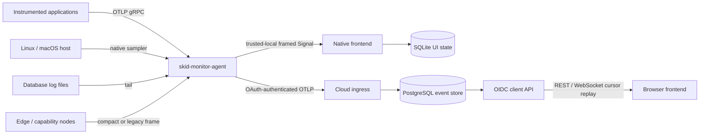

# Architecture

| 항목 | 값 |
| --- | --- |
| Status | Current behavior with explicit planned boundaries |
| Applies to | v0.1.x |
| Last verified | 2026-07-19 |
| Platforms verified | macOS arm64 runtime; workspace tests on macOS arm64 |

이 문서는 **현재 code가 어떻게 동작하는가**를 설명한다. 아직 채택 또는 구현되지 않은 선택은
마지막 `Planned design` 절에만 두고 RFC와 연결한다.

## System context

## Runtime components

| Component | 현재 책임 | 하지 않는 일 |
| --- | --- | --- |
| `skid-monitor-agent` | self/host 수집, OTLP·device·DB log receiver, pipeline fan-out | UI, file transfer, remote compute |
| `skid-monitor-fe` native | trusted-local listener, dashboard, bounded in-memory view, SQLite UI state | raw signal durability, remote ingress authentication |
| `skid-monitor-ingress` | agent OIDC 검증, OTLP envelope 저장과 ACK | 사용자 dashboard API |
| `skid-monitor-client-server` | user OIDC 검증, admin/query, ticket, cursor stream | agent ingest |
| PostgreSQL | tenant event, projection, agent, audit, ticket의 source of truth | OIDC identity 발급, backup policy 자동 구성 |
| capability nodes | edge/file/compute metadata signal 생성 | authenticated data plane, raw media, job execution |

## Solo data flow

1. agent가 약 15초마다 self-observation과 OS host metric을 만든다.
2. OTLP, device socket, database log receiver도 같은 `SignalPipeline`으로 들어온다.
3. `skid_client` exporter가 `Signal`을 JSON으로 직렬화하고 `u32` big-endian length prefix를 붙인다.
4. exporter는 signal마다 frontend loopback address에 새 TCP connection을 연다.
5. frontend는 listener endpoint와 resource attributes로 node/source/service를 분류하고 dashboard state를
   갱신한다.
6. SQLite에는 node summary와 alert state/event를 저장하지만 raw signal stream 전체는 저장하지 않는다.

Solo frontend는 numeric loopback bind만 허용하는 trusted-local receiver API를 사용한다. 여러 listener가
각자 thread에서 signal을 받으므로 서로 다른 agent 또는 connection 사이의 global ordering은 보장하지
않는다.

## Cloud data flow

1. agent의 authenticated OTLP exporter가 OAuth client-credentials token을 받는다.
2. metrics, traces, logs 요청에 restart-safe sequence를 붙여 cloud ingress로 보낸다.
3. ingress는 issuer, audience, tenant, role, agent identity를 확인한다.
4. PostgreSQL transaction이 tenant context를 설정하고 enabled tenant/agent를 검사한다.
5. tenant advisory lock 아래에서 event를 append하고 projection과 agent `last_seen_at`을 갱신한다.
6. commit이 끝난 뒤에만 ingress가 OTLP ACK를 반환한다.
7. browser는 OIDC user token으로 one-time stream ticket을 받고, 마지막 cursor 이후 event를
   REST/WebSocket으로 replay한다.

같은 tenant/agent/sequence와 같은 payload가 다시 오면 기존 cursor를 반환한다. 같은 sequence에 다른
kind 또는 payload를 재사용하면 conflict다. cursor는 tenant 안에서 commit order를 나타내며, wall
clock이나 agent sequence와 같은 값이 아니다.

## Trust boundaries

| 경계 | 현재 보호 | 제한 |
| --- | --- | --- |
| Native Solo listener | numeric loopback 강제, frame size와 read timeout | remote client 인증 없음 |
| Agent device ingress | 기본 `127.0.0.1:9101`, frame size 검증 | 설정으로 remote bind 가능하지만 자체 auth/rate limit/enrollment 없음 |
| Cloud agent ingress | HTTPS gRPC, OIDC/OAuth JWT, audience/role/tenant/agent claim, request caps | provider와 database 운영 설정 필요 |
| Cloud client access | user OIDC role, one-time ticket, tenant-scoped cursor, same-origin browser rule | reverse proxy와 login shell은 별도 배포 책임 |
| PostgreSQL | least-privilege runtime check, transaction-local tenant context, FORCE RLS | role/grant provisioning과 backup은 저장소 밖 운영 책임 |
| .NET extension | child process stdin JSON boundary | extension code 자체의 trust와 timeout/backpressure 정책은 완성되지 않음 |

인증 없는 device 또는 native TCP listener를 `0.0.0.0`에 직접 공개하면 안 된다. 외부 연결이 필요하면
인증된 tunnel/service mesh 같은 별도 신뢰 경계를 먼저 둔다.

## Storage boundaries

- native Solo의 SQLite는 dashboard 복원을 위한 node/alert state다. event store나 replay log가 아니다.
- Cloud의 PostgreSQL `signal_events`가 durable source of truth다.
- `signal_projection`은 event append transaction에서 함께 갱신되는 derived state다.
- PostgreSQL `LISTEN/NOTIFY`는 wake-up hint다. event payload나 durable queue가 아니며 실제 replay는
  cursor query가 담당한다.
- agent cloud `sequence_state_path`는 sequence allocator다. payload spool이 아니다.

## Failure behavior

| 상황 | 현재 동작 |
| --- | --- |
| agent 종료 | 새 signal 수집이 멈춘다. heartbeat/offline 판정은 아직 없다. |
| Solo frontend 단절 | 해당 TCP send가 실패하고 agent가 오류를 기록한다. 실패 payload는 replay되지 않는다. |
| device signal downstream 실패 | connection task가 오류를 기록한다. device ACK/replay protocol은 없다. |
| DB log downstream 실패 | poll 전 checkpoint로 되돌려 같은 process의 다음 poll에서 해당 line을 다시 읽는다. restart-safe checkpoint는 없다. |
| Cloud transient gRPC 오류 | 같은 sequence로 최대 3회 시도한다. process crash를 넘는 payload replay는 없다. |
| 같은 cloud sequence 재전송 | payload가 같으면 idempotent, 다르면 conflict다. |
| PostgreSQL notification 손실 | client server가 cursor query와 fallback poll로 보완한다. PostgreSQL event가 기준이다. |
| browser 재연결 | tenant-scoped cursor 이후부터 새 ticket으로 재연결한다. 제한 횟수 뒤에는 사용자 재시도가 필요하다. |

## Extension points

- agent receiver/processor/exporter/pipeline config
- `skid-edge-wire`의 allocation-free compact metrics frame
- out-of-process .NET extension host
- browser raw WebSocket bridge 또는 authenticated Cloud API adapter
- 별도 capability node binary

확장 기능도 canonical OTLP `Signal`을 유지하고, 권한이 큰 file/media/compute payload는 telemetry
control plane에서 분리한다.

## Non-goals

- enterprise observability backend 전체 대체
- remote execution scheduler 또는 arbitrary job runner
- device ingress를 raw media/file transport로 사용
- allowlist 밖 filesystem access 또는 write/upload/delete
- RFC가 존재한다는 이유만으로 runtime support를 선언

## Planned design

다음은 현재 동작이 아니다.

- SKDM v1 versioned/authenticated device framing
- production device enrollment, connection cap, rate limit
- authorized file offer/chunk/hash/resume plane
- actual edge hardware sensor adapter
- Windows host sampler와 service smoke test
- VRM loader/renderer/animation
- quantum provider job API adapter
- durable agent payload spool과 automated end-to-end docs smoke test

설계 이유와 열린 질문은 [RFC 0001](rfcs/0001-initial-skid-monitor-integration.md) 및
[RFC 0002](rfcs/0002-extensible-media-provider.md)를 따른다. 구현 여부는 항상
[Feature Status](feature-status.md)에서 확인한다.
