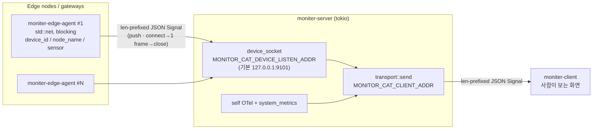
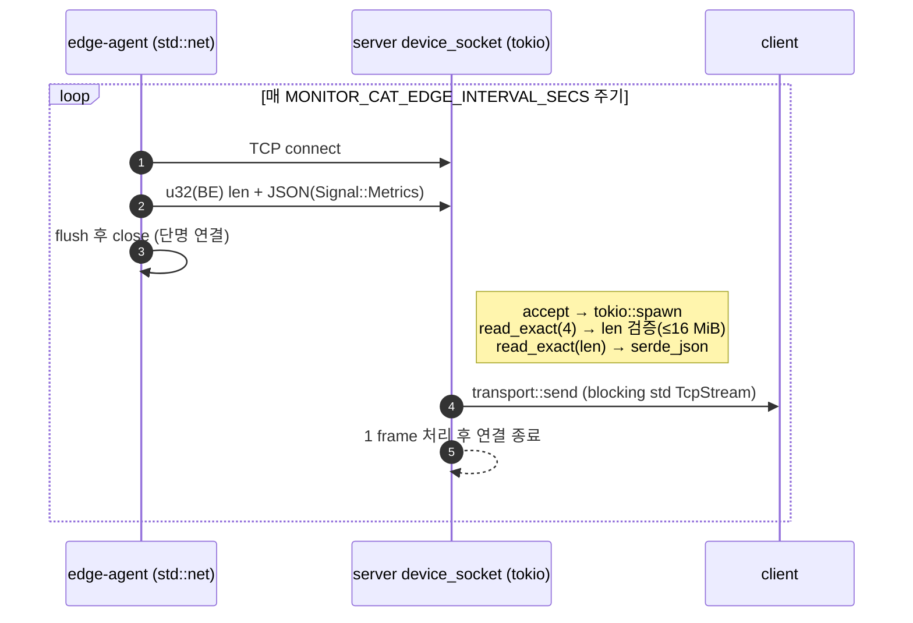
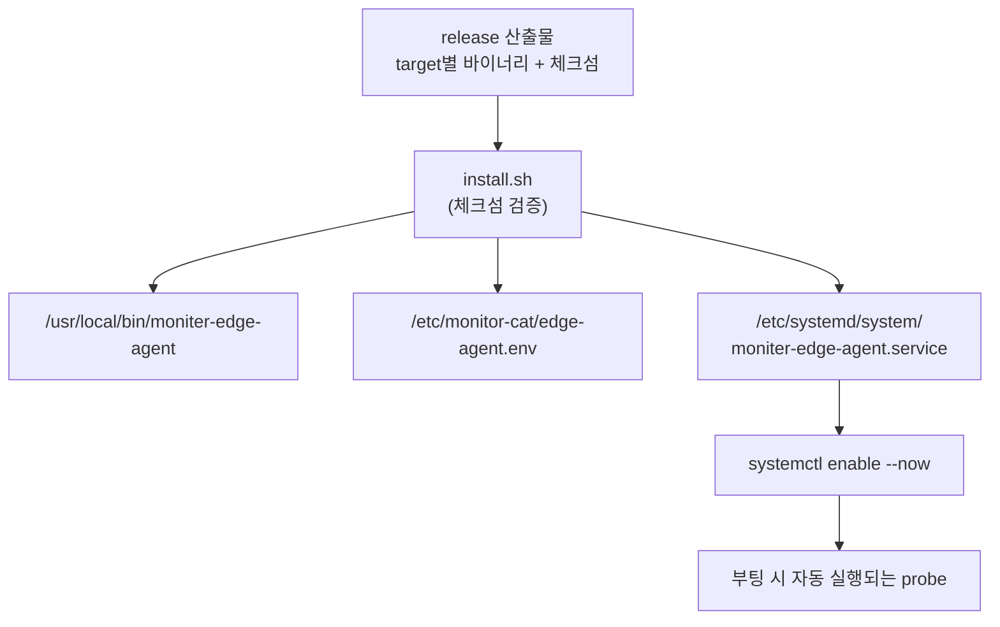
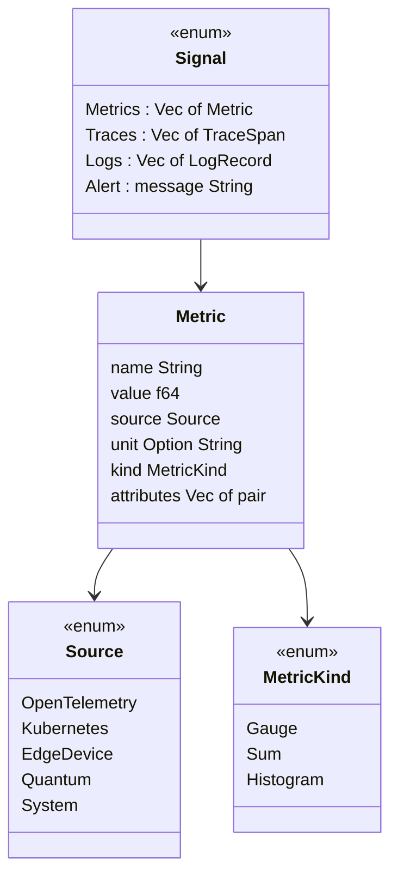
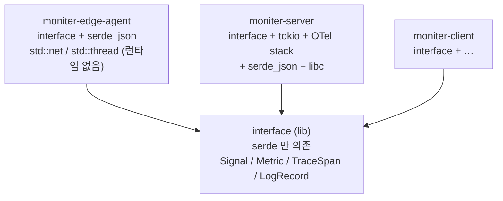

# Edge Agent Deployment

이 문서는 `moniter-edge-agent`와 `moniter-server`의 관계, 배포 경계, 설치 방식의
기본 결정을 명시한다.

## Role

`moniter-edge-agent`는 현장 장비 가까이에서 물리 계층과 환경 신호를 만드는 probe다.
`moniter-server`는 중앙 또는 사이트별 수집 지점으로, edge agent가 보낸 `Signal`을 받아
자체 host/system metrics와 함께 `moniter-client`로 전달한다.

관계는 다음과 같다.

```text
moniter-edge-agent
  -> edge physical metrics 생성
  -> length-prefixed JSON Signal 전송
  -> MONITOR_CAT_DEVICE_ADDR 로 접속

moniter-server
  -> MONITOR_CAT_DEVICE_LISTEN_ADDR 에서 장비 소켓 listen
  -> edge agent가 보낸 Signal 수신
  -> 자체 system metrics와 함께 client로 전달

moniter-client
  -> 사람이 보는 화면
```

따라서 `moniter-edge-agent`는 `moniter-server` 안에 포함되는 하위 모듈이 아니다. 같은
workspace와 `interface` 계약을 공유하지만, 실행과 배포 단위는 별도 바이너리로 둔다.

### 배포 토폴로지 (한눈에)



```text
   Edge nodes / gateways               moniter-server (tokio)            client
 +--------------------------+      +------------------------------+
 | moniter-edge-agent #1    |      | device_socket                |
 | std::net (blocking)      |==\   | LISTEN_ADDR :9101            |
 | device_id/node_name/     |   \  |        |                     |
 | sensor                   |    >=|        v                     |
 +--------------------------+   /  |  transport::send  ==CLIENT_ADDR==>  moniter-client
 +--------------------------+  /   |        ^                     |          (화면)
 | moniter-edge-agent #N    |=/    |  self OTel + system_metrics  |
 +--------------------------+      +------------------------------+
   ==> len-prefixed JSON Signal (push · connect→1 frame→close)
```

여러 edge agent가 하나의 server로 push하고, server는 자체 수집분과 합쳐 client로 다시
forward한다. 화살표 방향이 곧 신호의 흐름이자 연결을 먼저 거는 쪽이다.

## Network Model

현재 모델은 edge agent가 server로 신호를 push하는 방식이다. server가 edge agent에 접속해
pull하지 않는다.

```sh
# server (보안 기능이 들어가기 전에는 loopback 또는 신뢰된 내부 IP에만 bind)
MONITOR_CAT_DEVICE_LISTEN_ADDR=127.0.0.1:9101 moniter-server

# edge node 또는 gateway
MONITOR_CAT_DEVICE_ADDR=server-ip-or-hostname:9101 moniter-edge-agent
```

> `0.0.0.0:9101`로 모든 인터페이스에 bind하는 것은 device 인증이 들어간 뒤로 미룬다.
> 현재 소켓은 인증이 없고 받은 `Signal`을 검증 없이 client로 forward하므로, 공개 bind는
> 임의 신호 주입과 메모리 고갈 DoS의 직접 경로가 된다. 아래 Security Requirements 참고.

### Listen 개방 정책 (`skid-node` 참고)

`LuticaCANARD/skid-node`(README상 `replica`)의 설정 모델은 `transports[].listen`과
`transports[].connect`를 명시적으로 나누고, 노드 역할(`start`/`relay`/`end`)과
control/data transport를 분리한다. monitor-cat은 아직 설정 파일 기반 mesh나 다중 transport를
갖고 있지 않지만, 같은 원칙을 적용한다. 즉 `MONITOR_CAT_DEVICE_LISTEN_ADDR`는 "편의를 위해
아무 곳에나 여는 스위치"가 아니라 **어떤 네트워크 경계에 device ingress를 노출할지 결정하는
운영 계약**이다.

현재 코드가 실제로 지원하는 listen 형태는 다음 네 가지로 해석한다.

| 값 | 의미 | 운영 판단 |
| --- | --- | --- |
| `MONITOR_CAT_DEVICE_LISTEN_ADDR=off` | device ingress 비활성화 | edge agent를 받지 않는 server |
| `127.0.0.1:9101` | 같은 host 안에서만 수신 | 개발, 단일 gateway, sidecar 실험의 기본값 |
| `<trusted-lan-ip>:9101` | 특정 내부 NIC/VPN IP에서만 수신 | 현재 코드로 열 수 있는 최대 범위 |
| `0.0.0.0:9101` | 모든 NIC에서 수신 | 현재 구현에서는 금지, 보안 기능 이후에만 허용 |

현재 구현으로 listen을 열 때의 순서는 다음과 같다.

1. **local 개발/단일 gateway**

   ```sh
   MONITOR_CAT_DEVICE_LISTEN_ADDR=127.0.0.1:9101 moniter-server
   MONITOR_CAT_DEVICE_ADDR=127.0.0.1:9101 moniter-edge-agent
   ```

   같은 host 안에서만 열리므로 인증 부재의 blast radius가 가장 작다.

2. **site LAN 또는 장비망**

   ```sh
   # server: eth0 같은 신뢰된 내부 NIC의 실제 IP에만 bind
   MONITOR_CAT_DEVICE_LISTEN_ADDR=10.0.3.5:9101 moniter-server

   # edge node 또는 gateway
   MONITOR_CAT_DEVICE_ADDR=10.0.3.5:9101 moniter-edge-agent
   ```

   이때도 `0.0.0.0` 대신 server의 내부 IP 하나를 직접 지정한다. host firewall/security group은
   edge node CIDR 또는 device gateway IP만 `tcp/9101`로 허용한다. 현재 monitor-cat에는
   `skid-node`의 `interface: eth0` 같은 NIC pinning 필드가 없으므로, bind address와 firewall이
   사실상의 interface pinning 역할을 한다.

3. **원격 edge 또는 NAT 뒤 장비**

   public internet에 `9101`을 직접 열지 않는다. `skid-node`의 relay-chain tunnel처럼 L4 경로를
   분리해 생각하고, monitor-cat에서는 우선 WireGuard/Tailscale 같은 overlay 주소에만 listen을 연다.
   터널을 둘 경우 end target은 `127.0.0.1:9101` 또는 server의 내부 IP `:9101` 하나로 고정하고,
   임의 target forwarding은 허용하지 않는다.

   ```sh
   # server overlay IP
   MONITOR_CAT_DEVICE_LISTEN_ADDR=100.64.10.5:9101 moniter-server

   # edge overlay peer
   MONITOR_CAT_DEVICE_ADDR=100.64.10.5:9101 moniter-edge-agent
   ```

   이 형태에서는 public endpoint가 VPN/overlay 계층이고, monitor-cat device socket은 overlay
   내부 서비스가 된다.

보안 기능을 갖춘 뒤에만 공개 listen을 검토한다. 공개 listen의 최소 조건은 다음과 같다.

- 전송 보호: WireGuard/Tailscale overlay를 기본값으로 두고, 직접 public TCP를 열어야 한다면 TLS
  또는 mTLS를 먼저 넣는다.
- 장비 신원: device enrollment token, shared secret, 또는 client certificate로 `device_id`와
  연결 신원을 묶는다. 인증 실패 프레임은 `Signal`로 decode하거나 forward하지 않는다.
- 노출 범위: 가능하면 특정 public/overlay IP에 bind하고, `0.0.0.0`은 firewall, rate limit,
  인증, 관측이 모두 준비된 배포에서만 쓴다.
- 수신 제한: 동시 연결 수, read timeout, per-device rate limit, frame size, backpressure를 둔다.
  현재는 connection마다 무제한 `tokio::spawn`이고 forward 경로도 blocking이므로 이 조건을
  만족하지 못한다.
- 세션 상태: 영속 연결 또는 애플리케이션 heartbeat로 last-seen을 관리한다. `skid-node` tunnel의
  `Ping`/`Pong` 예약처럼, 연결 생존과 데이터 프레임을 같은 운영 모델에서 다룬다.
- 신호 등급: `Alert`는 retry/ack/buffer 같은 더 강한 전달 보장을 받고, 일반 metric은 손실 허용
  정책을 명시한다.

목표 상태의 예시는 다음과 같다. 아래 환경변수들은 설계 방향을 표현한 것이며, 현재 repository에
아직 구현되어 있지 않다.

```sh
MONITOR_CAT_DEVICE_LISTEN_ADDR=0.0.0.0:9101
MONITOR_CAT_DEVICE_TLS_CERT=/etc/monitor-cat/device-ingress.crt
MONITOR_CAT_DEVICE_TLS_KEY=/etc/monitor-cat/device-ingress.key
MONITOR_CAT_DEVICE_CLIENT_CA=/etc/monitor-cat/device-ca.crt
MONITOR_CAT_DEVICE_ALLOWED_CIDRS=10.0.3.0/24,100.64.0.0/10
MONITOR_CAT_DEVICE_MAX_CONNECTIONS=256
MONITOR_CAT_DEVICE_READ_TIMEOUT_SECS=5
```

따라서 현재 답은 명확하다. **지금 listen은 loopback 또는 특정 trusted LAN/overlay IP로만 열고,
보안으로 열 때는 overlay/VPN 또는 mTLS + device enrollment + 연결 제한을 갖춘 뒤에만
`0.0.0.0` 공개 bind를 허용한다.**

### push 모델의 신뢰성 한계

push를 택했지만 현재 edge agent에는 **재시도, 백오프, 로컬 버퍼링이 없다.** 전송 실패 시
stderr에 기록하고 다음 주기로 넘어가며, 그 사이 신호는 영구 손실된다. server 재시작이나
네트워크 단절 구간의 brownout, watchdog reset 같은 장애 신호가 정확히 그 순간 유실되기
가장 쉽다. 운영 전에는 최소한 재연결 + 백오프, 가능하면 짧은 로컬 버퍼(전송 실패분 보관)를
추가한다. pull 또는 hybrid 모델은 server 복구 시 재수집 여지를 주므로 장기적으로 재검토 대상이다.

하나의 `moniter-server`에는 여러 `moniter-edge-agent`가 연결될 수 있다.

현재 구현에서 각 agent가 metric에 붙이는 attribute는 `device_id`, `node_name`,
`sensor` 세 가지다. `rack`, `zone` 같은 위치 attribute는 아직 코드에 없으며, 도입하려면
설정(env)과 attribute 채움 양쪽을 함께 추가해야 한다. 즉 이 둘은 현재 구현이 아니라
향후 식별 모델의 목표값이다.

### Connection lifecycle (현재 구현의 한계)

현재 `moniter-server`의 장비 소켓은 **연결당 단일 `Signal` 프레임을 읽고 연결을 닫는다.**
그래서 edge agent도 매 전송 주기마다 `connect -> 1 frame -> close`를 반복한다. 상시 유지되는
세션이 아니다. 이 모델은 다음 한계를 동반한다.

- 연결 자체로는 heartbeat/last-seen을 알 수 없다. 신호가 끊긴 것인지 단지 다음 interval이
  안 된 것인지 server가 연결 수준에서 구분하지 못한다. 따라서 아래 Security Requirements의
  device heartbeat는 별도 애플리케이션 레벨 상태 테이블과 타임아웃으로 구현해야 한다.
- 매 주기마다 TCP handshake를 반복한다. mTLS를 얹으면 매 전송마다 TLS handshake까지
  반복되어 비용이 커진다. 장기 실행 probe라는 성격과 단명 연결은 어긋난다.

운영 전 개선 목표는 영속 연결 위에서 프레임을 스트리밍하고, 그 연결에 heartbeat를 실어
last-seen을 갱신하는 형태다.

### 수발신 경로 (현재 구현)



```text
edge-agent (std::net)        server device_socket (tokio)         client
      |                              |                              |
      | (1) TCP connect              |                              |
      |----------------------------->|                              |
      | (2) u32(BE) len + JSON       | accept → tokio::spawn        |
      |     Signal::Metrics          | read_exact(4) → len ≤ 16MiB  |
      |----------------------------->| read_exact(len) → serde_json |
      | (3) flush & close            |                              |
      |- - - - - - - - - - - - - - ->| (4) transport::send          |
      |                              |     (blocking std TcpStream)  |
      |                              |----------------------------->|
      |                              | 1 frame 처리 후 연결 종료    |
      |==== 반복: 매 INTERVAL_SECS 주기 ============================|
```

송수신 방식을 코드 기준으로 정리하면 다음과 같다.

- **agent 송신부**(`moniter-edge-agent/src/main.rs`)는 동기 `std::net::TcpStream`을 쓴다.
  매 주기 `connect → write(len) → write(payload) → flush → close`이고, 비동기 런타임이 없다.
  전송 실패는 `eprintln!`로만 남고 신호는 유실된다(위 push 한계와 동일).
- **server 수신부**(`moniter-server/src/device_socket.rs`)는 tokio `TcpListener`로
  `accept` 후 연결마다 `tokio::spawn`하지만, 각 task는 **프레임 한 개만 읽고 닫는다**.
  프레임 상한은 `MAX_FRAME_BYTES = 16 MiB`이고, agent 측에는 자체 상한이 없다(현재 payload가
  작아 무방).
- **forward 경로의 함정**: server는 수신한 `Signal`을 `transport::send`로 client에 넘기는데,
  이 함수는 async task 안에서 **blocking `std::net::TcpStream`**을 호출한다. 즉 동기 connect/
  write가 tokio worker thread를 점유한다. 단명·저빈도 연결에서는 드러나지 않지만, 동시 연결
  제한이 없는 현재 구조(아래 Security Requirements)와 겹치면 worker starvation으로 번질 수
  있다. 운영 전 정리 시 `tokio::net` 기반 비동기 전송 또는 `spawn_blocking` 격리가 필요하다.
- 연결 수준 backpressure가 없다. accept한 만큼 무제한 task가 생기고, 각 task의 forward가
  blocking이라는 점이 결합 위험이다.

## Server ↔ Client 연결단 (검토)

edge agent의 다음 hop은 `moniter-server` → `moniter-client` 구간이다. edge agent 배포 자체는
아니지만 같은 와이어 포맷을 공유하고 신호의 최종 도달을 결정하므로 함께 검토한다. 코드 기준으로
이 구간은 **device 소켓과 같은 단명 연결 패턴을 그대로 복제**한다.

```text
   moniter-server (producer)                 moniter-client (consumer)
   transport::send                           receiver::Receiver
   std::net TcpStream  ── connect ──────────> TcpListener.accept()
   MONITOR_CAT_CLIENT_ADDR                    MONITOR_CAT_CLIENT_ADDR (listen)
        |  u32(BE) len + JSON (신호 1개)            |  read_exact → serde_json
        |  write → flush → close                    |  view::render → 다음 accept
        v                                           v
   주기마다 Metrics/Traces/Logs = connect 3회   단일 스레드 순차 처리(backlog 대기)
```

| 구분 | server 송신부 (`transport.rs`) | client 수신부 (`receiver.rs`/`main.rs`) |
| --- | --- | --- |
| 역할 | TCP **dial** (connect) | TCP **listen** (accept) |
| 연결 수명 | 신호 1개당 connect→write→close | accept→1 frame 읽고 close |
| 프레이밍 | u32 BE len + JSON, 16 MiB 상한 | 동일 |
| 동시성 | blocking `std::net` (tokio 안) | 단일 스레드 순차 loop |
| 실패 시 | 로그만 남기고 유실 | 부분 프레임이면 다음 accept로 |

평가:

- **좋은 점 — 3-hop 동형성**: agent→server→client 전 구간이 같은 프레이밍(`u32 BE len + JSON`,
  16 MiB)을 쓴다. 와이어 포맷 하나만 이해하면 전 구간을 디버깅할 수 있고, 계약(`interface`)이
  한곳이라 일관적이다. 초기 단계 설계로는 합리적이다.
- **문제 1 — 연결 방향이 역할명과 어긋난다(가장 본질적)**: 데이터 생산자인 `moniter-server`가
  소비자인 `moniter-client`에 **연결을 건다**. 즉 client가 TCP 서버(listen), server가 TCP
  클라이언트(dial)다. push로는 일관되나, client가 항상 먼저 listen하고 있어야 push가 성립하고
  client 재시작 구간의 신호는 유실된다. 다중 client·NAT·방화벽 구성에서 직관과 반대로 동작한다.
  보통 관측 데이터는 소비자가 생산자에 연결(pull/subscribe)하거나 브로커를 두는 편이 운영이 쉽다.
- **문제 1-a — client 주소를 모르면 폐기된다**: dial 방향의 직접적 귀결이다. `transport::send`는
  `MONITOR_CAT_CLIENT_ADDR`가 없으면 `send_tcp`를 호출하지 않고 직렬화된 JSON을 info 로그로만
  출력한다(`Err(_) => info!(... "client 미연결")`). 즉 **주소를 모르는 상태에서는 신호가
  로그를 제외하고 전부 손실**된다. 주석상 "client 미구현 단계 검증용" fallback이지만, 운영에서는
  사실상 무전송이다. 더 나아가 이 구조에는 (1) client가 자기 주소를 알릴 **디스커버리 경로가 없고**,
  (2) 주소 확보 전까지 모아두는 **버퍼링이 없으며**, (3) env var가 하나라 **client를 1개만 지정**할
  수 있어 fan-out이 구조적으로 불가능하다. "주소를 모르는 정상 상태"가 존재한다는 것 자체가 연결
  방향이 잘못 잡혔다는 신호다 — 방향을 뒤집으면(client가 server에 subscribe) server는 주소를 몰라도
  되고, 연결해 온 client(들)에게 push하면 되므로 이 문제 자체가 사라진다.
- **문제 2 — device단 한계의 복제**: 단명 연결 + 연결당 1 프레임이 이 구간에도 그대로 있다.
  `run_cycle` 한 주기가 Metrics/Traces/Logs 3 신호를 보내므로 주기마다 connect/close가 3회
  일어난다. 세션이 없어 heartbeat/last-seen을 연결 수준에서 알 수 없고, TLS를 얹으면 신호마다
  handshake가 반복된다.
- **문제 3 — blocking I/O가 async 런타임 안에 있다**: 위 forward 함정과 동일 원인이다.
  `transport::send`는 동기 `std::net`인데 server의 async `run_cycle`과 device forward 양쪽에서
  호출된다.
- **문제 4 — client 단일 스레드 순차 처리**: `recv()`가 accept→render를 직렬로 돈다. 한 연결을
  처리하는 동안 다른 연결은 backlog에서 대기한다. 저빈도·단명 연결이라 지금은 안 터지지만,
  다중 server나 버스트에는 병목이다.
- **문제 5 — 손실 허용이 무차별적이다**: server는 연결 실패 시 로그만 남기고 버린다. 메트릭이면
  합당하나 `Signal::Alert`(경보)도 같은 경로로 똑같이 유실된다. 신호 종류별 전달 보장 차등이 없다.

운영 전 개선 우선순위:

1. **연결 방향 재고** — client가 server에 붙어 구독하거나 영속 연결 위 스트리밍으로 바꾸면
   client 재시작 내성과 다중 client가 자연스러워진다(가장 구조적).
2. **영속 연결 + 프레임 스트리밍** — 단명 1프레임 패턴을 걷어내면 heartbeat·handshake 비용·세션
   부재가 한 번에 풀린다(device단과 같은 해법 공유).
3. **blocking 격리** — `tokio::net` 전환 또는 `spawn_blocking`.
4. **신호 등급화** — Alert엔 재시도/버퍼, 메트릭은 손실 허용 유지.

부수적으로 `read_signal`/`send_tcp`가 `device_socket`·`transport`·`receiver` 세 곳에 거의
복붙되어 있다. 와이어 포맷을 `interface`로 끌어올리면 3-hop 동형성이 코드 수준에서도 보장된다.

## Deployment Decision

기본 배포 방식은 단일 Rust 바이너리와 systemd 서비스다.

이 결정을 기본값으로 두는 이유는 다음과 같다.

- edge agent는 장비 또는 gateway에서 계속 떠 있어야 하는 장기 실행 프로세스다.
- GPIO, I2C, serial, 온도 센서, 전원 상태 같은 로컬 하드웨어를 직접 읽을 가능성이 높다.
- 컨테이너는 `/dev` 마운트, privileged 권한, host network 같은 설정이 늘어나기 쉽다.
- 작은 단일 바이너리는 현장 장비에 설치, 교체, 롤백하기 쉽다.

컨테이너 이미지는 센서 없는 lab 환경이나 gateway 시뮬레이션에는 사용할 수 있지만, 기본
운영 배포 모델로 보지는 않는다.

단, 하드웨어 직접 접근을 근거로 들었으면 그에 따르는 권한 모델도 배포 단위의 일부로 둔다.
systemd unit은 root 상시 실행 대신 전용 사용자 + 필요한 device만 `DeviceAllow`로 허용하고,
serial/GPIO는 `dialout`/`gpio` 그룹 또는 udev 규칙으로 부여하는 것을 기본 형태로 한다.
이 권한 설계 없이 단순 root 실행으로 두면 "컨테이너 권한이 늘기 쉽다"는 회피 논거가 약해진다.

## Recommended Install Shape

초기 설치 흐름은 다음을 목표로 한다.



```text
 release 산출물 (target별 바이너리 + 체크섬)
            |
            v
      install.sh  (체크섬 검증)
       |     |        |
       v     v        v
 /usr/local  /etc/    /etc/systemd/system/
 /bin/       monitor- moniter-edge-agent.service
 moniter-    cat/             |
 edge-agent  edge-            v
             agent.env  systemctl enable --now
                              |
                              v
                      부팅 시 자동 실행 probe
```

1. GitHub Release 또는 내부 release 저장소에 target별 바이너리를 게시한다.
2. 설치 스크립트가 바이너리를 `/usr/local/bin/moniter-edge-agent`에 배치한다.
3. 설정 파일을 `/etc/monitor-cat/edge-agent.env`에 만든다.
4. systemd unit을 `/etc/systemd/system/moniter-edge-agent.service`에 만든다.
5. `systemctl enable --now moniter-edge-agent`로 부팅 시 자동 실행되게 한다.

설정 파일 예시는 다음과 같다.

```sh
MONITOR_CAT_DEVICE_ADDR=10.0.0.5:9101
MONITOR_CAT_EDGE_DEVICE_ID=edge-dev-001
MONITOR_CAT_EDGE_NODE=factory-a-line-3
MONITOR_CAT_EDGE_INTERVAL_SECS=15
```

사용자가 기대하는 설치 UX는 다음 형태다.

```sh
curl -fsSL https://example.com/monitor-cat/moniter-edge-agent/install.sh | sudo sh -s -- \
  --server 10.0.0.5:9101 \
  --device-id edge-dev-001 \
  --node factory-a-line-3
```

`curl | sudo sh`는 시연용 UX일 뿐, 운영 기본 경로로 보지 않는다. 이 방식만으로는 바이너리
무결성 검증(서명/체크섬), 멱등 재설치, 깔끔한 언인스톨/롤백을 보장하지 못한다. 롤백이 쉽다는
단일 바이너리의 장점을 실제로 살리려면 아래 Release Targets의 `.deb`/`.rpm` + 내부 저장소를
"확장"이 아니라 권장 경로로 앞당기고, install.sh에는 최소한 체크섬 검증 단계를 포함한다.

## Release Targets

초기 release에는 다음 Linux target을 우선한다.

- `x86_64-unknown-linux-gnu`
- `aarch64-unknown-linux-gnu`
- `armv7-unknown-linux-gnueabihf`

운영 환경이 다양해지면 `musl` 기반 정적 바이너리도 제공한다. 장비 수가 늘어나면
`install.sh` 중심 배포에서 `.deb` 또는 `.rpm` 패키지와 내부 패키지 저장소로 확장한다.

### 설치 방식 검토 (현재 상태)

위 설치 흐름·타깃·UX는 전부 **목표 상태**이며, 현재 repository에는 실제 산출물이 없다.
`install.sh`, systemd unit, `edge-agent.env` 템플릿, release CI, `.deb`/`.rpm` 어느 것도
아직 커밋되어 있지 않고, agent 빌드도 cross-target 설정 없이 호스트 기본 toolchain만 가정한다.
따라서 문서가 약속하는 "쉬운 설치·롤백"은 다음이 갖춰져야 실제로 성립한다.

- release 파이프라인: 세 Linux 타깃 cross-build + 체크섬/서명 생성
- `install.sh`: 체크섬 검증, 멱등 재설치, 언인스톨 경로 포함(현재 `curl | sudo sh` 예시는 미충족)
- systemd unit 템플릿: Deployment Decision의 전용 사용자 + `DeviceAllow` 권한 모델 반영

즉 이 절은 "구현 완료"가 아니라 설치 산출물에 대한 합의된 목표로 읽어야 한다.

## Interface Contract (검토)

agent와 server가 공유하는 계약은 `interface` 크레이트 한 곳에 모여 있다. 실제 코드 기준으로
계약의 표면과 agent가 그중 실제로 쓰는 범위를 구분하면 다음과 같다.



```text
Signal (enum)
 ├─ Metrics(Vec<Metric>)    <── edge-agent가 보내는 유일한 variant
 ├─ Traces(Vec<TraceSpan>)
 ├─ Logs(Vec<LogRecord>)
 └─ Alert { message }

Metric
 ├─ name        : String
 ├─ value       : f64
 ├─ source      : Source ──> { OpenTelemetry, Kubernetes, EdgeDevice*, Quantum, System }
 ├─ unit        : Option<String>            (* agent는 EdgeDevice만 사용)
 ├─ kind        : MetricKind ──> { Gauge, Sum, Histogram }
 └─ attributes  : Vec<(String,String)>  = device_id, node_name, sensor (고정)
```

- **계약 표면 vs. 사용 범위**: `Signal`은 `Metrics`/`Traces`/`Logs`/`Alert` 4 variant를
  가지지만, edge agent는 `Signal::Metrics`만 생성한다. 반대로 server 수신부는 4종을 모두
  디코드하고 검증 없이 forward한다. 즉 agent가 쓰는 계약은 전체의 부분집합이고, 신뢰 경계는
  "agent가 보내는 것"이 아니라 "소켓이 받는 것" 전체로 잡아야 한다(Security Requirements와 연결).
- **출처/속성 고정값**: agent의 모든 metric은 `source = Source::EdgeDevice`이고 attribute는
  `device_id`, `node_name`, `sensor` 세 개로 고정이다(`make_metric`). `Source`에는
  `EdgeDevice` 외에 `OpenTelemetry`/`Kubernetes`/`Quantum`/`System`도 있으나 agent는 쓰지
  않는다. `rack`/`zone` 같은 위치 attribute는 앞서 적었듯 아직 코드에 없다.
- **프레이밍 일치**: 송신(`send_tcp`)과 수신(`read_signal`) 모두 `u32` 빅엔디언 길이 프리픽스 +
  serde_json(externally-tagged) 본문으로 동일하다. 둘 중 한쪽만 바꾸면 즉시 깨지는 결합이므로,
  프레이밍·인코딩 변경은 반드시 `interface` 계약 변경으로 함께 다룬다.
- **버전 부재**: `Signal`에는 버전 필드가 없다. 이로 인한 선행 작업은 아래 Versioning에서 다룬다.
- **`MetricKind::Sum`의 의미 주의**: `edge.boot.count`(1.0)/`edge.watchdog.resets`(0.0)는
  `Sum`으로 표기되지만 현재는 매 주기 누적이 아닌 스냅샷 상수를 보낸다. mock 단계에서는 무방하나,
  실제 센서 구현에서 누적/단조 증가 의미를 살리려면 값 생성 쪽을 계약 의미에 맞춰야 한다.

## Versioning

`moniter-edge-agent`와 `moniter-server`는 독립 실행 파일이지만 같은 `interface` 계약을
공유한다. 초기에는 같은 repository release 안에서 같은 버전으로 묶어 배포한다.

현재 `interface`의 `Signal`은 버전 필드가 없는 plain enum이고, serde_json의
externally-tagged 표현으로 직렬화된다. 이 상태에서는 나중에 envelope를 끼워 버전을
넣는 것 자체가 breaking change다. 따라서 protocol version은 "프로토콜이 바뀌면 추가"하는
항목이 아니라, **호환 깨짐이 비싸지기 전인 지금 envelope에 먼저 넣어야** 하는 선행 작업이다.

도입 시 함께 정하는 것:

- `Signal` envelope의 protocol version 필드 (지금 추가)
- server의 backward-compatible decode 규칙 (알 수 없는 variant/필드 무시)
- agent와 server의 최소 호환 버전 명시

이와 별개로 인코딩 변경(CBOR/postcard 등)은 현재 edge agent가 Linux 위 Rust 바이너리이지
MCU 펌웨어가 아니라는 점을 전제로 판단한다. JSON 제약은 아직 MCU 제약이 아니므로, compact
인코딩은 실제로 펌웨어에 직접 올리는 probe가 생기거나 대역폭 제약이 측정될 때 도입한다.

## Security Requirements

현재 구현은 plain TCP와 JSON frame을 사용하고, 장비 소켓에는 인증이 없다. 또한 server는 받은
`Signal`을 검증 없이 그대로 client로 forward한다. 따라서 소켓에 접근 가능한 누구든

- 가짜 metric이나 임의 `Signal::Alert`를 주입해 client 화면을 오염시킬 수 있고,
- 16 MiB 프레임 상한과 연결 수 제한 없는 수락(connection당 unbounded task spawn)을 이용해
  메모리 고갈 DoS를 일으킬 수 있다.

production 배포 전에는 다음 항목을 추가해야 한다.

- TLS, mTLS, WireGuard, Tailscale 중 하나를 통한 전송 보호
- device enrollment token 또는 shared secret 기반 장비 인증
- 동시 연결 수 제한과 per-connection backpressure (현재는 무제한 spawn)
- server의 device heartbeat와 last-seen 상태 관리 (단명 연결 구조상 애플리케이션 레벨로 구현)
- agent 로그와 restart 상태 확인 방법

보안 기능이 들어가기 전에는 `0.0.0.0` 공개 bind를 피하고, 같은 trusted LAN 또는 개발
환경에서 loopback/신뢰된 내부 IP에만 bind해 사용한다.

## Dependency Structure (종속 SW 구조 검토)

workspace는 `interface`(공유 계약), `moniter-edge-agent`, `moniter-server`,
`moniter-client` 네 크레이트로 구성된다(edition 2024, resolver 3). 의존 방향은 다음과 같다.



```text
              interface (lib) ── serde 만
       Signal / Metric / TraceSpan / LogRecord
              ^          ^          ^
              |          |          |
    +---------+          |          +----------+
    |                    |                     |
 moniter-edge-agent  moniter-server     moniter-client
 interface           interface +        interface + …
 + serde_json        tokio + OTel +
 std::net/thread     serde_json + libc
 (런타임 없음)       (Linux 묶임)
```

검토 결과 핵심은 **의도적 비대칭**이다.

- **`interface`는 의도적으로 가볍다**: 의존성은 `serde`(derive) 하나뿐이고 OTel/tokio를
  들이지 않는다. 양쪽이 공유하는 계약을 무겁게 만들지 않으려는 결정이며, agent가 server의
  무거운 스택을 상속하지 않게 하는 핵심 장치다.
- **edge-agent는 최소 의존**: `interface + serde_json`만 쓴다. 비동기 런타임도, OTel도,
  로깅 프레임워크(tracing)도 없이 `std::net`/`std::thread`/`eprintln!`으로 동작한다. 이는
  Deployment Decision의 "작은 단일 바이너리" 논거와 Versioning의 "향후 MCU/펌웨어 probe"
  가능성 양쪽을 떠받친다. 단 재시도/백오프/버퍼링/구조적 로깅이 없다는 한계도 이 최소 구성의
  직접적 결과다.
- **server는 무거운 쪽**: tokio(full) + OpenTelemetry 0.31 코호트(otlp/sdk/appender) +
  tracing-opentelemetry 0.32 + serde_json + libc(Linux `/proc`/`statvfs`)에 의존한다.
  여기서 server는 사실상 Linux 호스트에 묶인다(libc 직접 사용).
- **버전 일원화**: 공유 의존성은 `[workspace.dependencies]`로 한곳에서 고정되어 agent와
  server가 같은 `serde`/`serde_json` 라인을 쓴다. 계약 직렬화 호환성 측면에서 바람직하다.
- **검토 시 주의점**: agent에 재연결/백오프/버퍼링을 넣을 때 tokio 같은 무거운 런타임을
  agent로 끌어오면 위의 "최소 의존" 이점이 약해진다. 가능한 한 `std` 또는 경량 의존으로
  유지하고, 무거운 비동기 스택은 server 쪽에 두는 현재 경계를 지키는 편이 낫다.

## Summary

`moniter-server`는 edge 신호를 받아 client로 전달하는 gateway이고, `moniter-edge-agent`는
현장 장비 가까이에서 물리 신호를 만들어 보내는 probe다. 배포 기본값은 정적 또는 단일
바이너리, env 설정 파일, systemd 서비스다.
