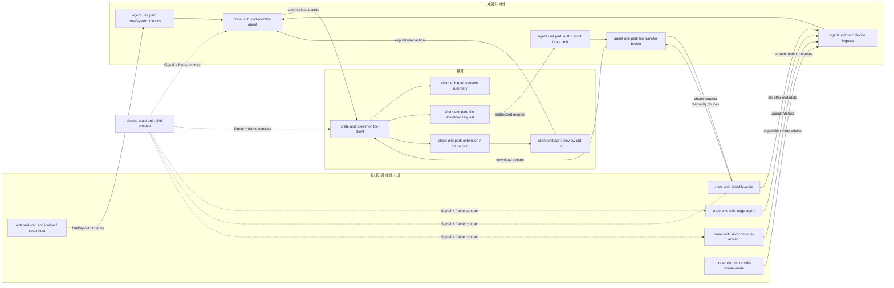
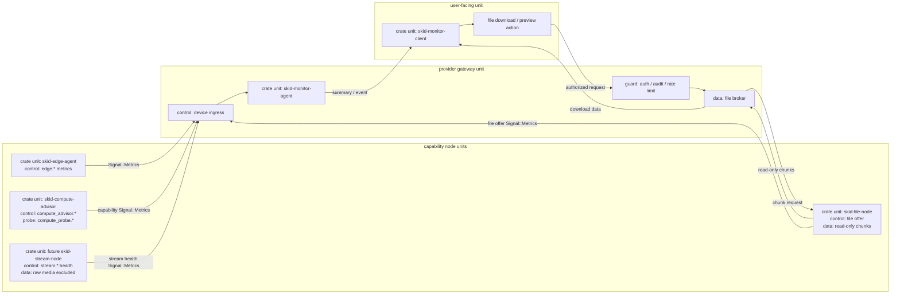

# RFC 0001: Initial Skid Monitor Integration

| 항목 | 값 |
| --- | --- |
| Status | Draft |
| Created | 2026-06-27 |
| File | `docs/rfcs/0001-initial-skid-monitor-integration.md` |
| Scope | `skid-protocol`, `skid-monitor-agent`, `skid-monitor-client`, `skid-edge-agent`, `skid-file-node`, `skid-compute-advisor`, future `skid-stream-node` |
| Protocol | `skid-protocol::protocol::Signal` over `skid-protocol::frame` legacy length-prefixed JSON today, SKDM v1 next |
| Decision Type | Initial repository umbrella, deployment boundary, configuration, framing, capability telemetry |

## Abstract

이 RFC는 Skid Monitor의 초기 통합 계약이다. 이전에 배포 경계, 설정/transport, device
framing, compute probe, stream telemetry로 나누어 적었던 설계를 하나의 초기 RFC로 합치고,
2026-06-28 personal repository harvest에서 가져갈 요소를 우선순위가 있는 실행 계약으로 반영한다.

핵심 결정은 `skid-monitor`를 SKID 계열 실험의 canonical integration repository로 두고, 다른
`skid-*` repository는 조사와 설계의 source로만 취급한다는 것이다. 채택할 기능은 먼저 이 RFC에
기록하고, 실제 구현은 이 repository 안에서만 진행한다.

## Detailed Introduction

Skid Monitor는 애플리케이션, Linux host, edge 장비, read-only file node, compute capability,
future stream sidecar에서 나오는 신호를 하나의 가벼운 관측 흐름으로 모으려는 실험이다. 첫 단계의
목표는 "무엇을 실행할 수 있는가"보다 "어디에서 무엇을 관측했고, 그 신호를 어떤 경계로 안전하게
흘릴 것인가"를 고정하는 것이다. 그래서 이 RFC는 기능 목록이 아니라 초기 통합 경계에 대한 문서다.

현재 repository의 중심은 여섯 crate다.

- `skid-protocol`: agent, client, capability node가 공유하는 `Signal`/metric 계약
- `skid-monitor-agent`: host/system/OpenTelemetry 신호를 수집하고 device ingress를 여는 gateway
- `skid-monitor-client`: 사람이 보는 console client와 C# extension host 경계
- `skid-edge-agent`: edge 물리/환경 신호를 만드는 작은 probe
- `skid-file-node`: read-only root의 가용성, 파일 offer, client-server 파일 교신을 담당하는 file capability node
- `skid-compute-advisor`: 병렬 처리 capability와 route advice 후보를 알리는 compute node

여기에 future `skid-stream-node`와 quantum adapter가 붙을 수 있다. 단, future node도 같은 원칙을
따른다. raw media frame, compute input 같은 큰 payload나 권한이 필요한 데이터는 초기 device socket으로
보내지 않는다. file chunk download는 제품 범위에 포함하되, device metric `Signal` payload가 아니라
별도 file transfer plane으로 분리한다. device socket은 우선 telemetry와 capability metadata를 흘리는
control plane이다.

제품 동작 topology를 먼저 보면 다음과 같다. 이 RFC에서 "제공자 서버"는 monitoring signal을 받아
사용자에게 제공하는 `skid-monitor-agent` 쪽 gateway를 뜻한다.

```text
+--------------------------------+      +--------------------------------+      +--------------------------------+
| 모니터링 대상 서버             |      | 제공자 서버                    |      | 유저                           |
|--------------------------------|      |--------------------------------|      |--------------------------------|
| +----------------------------+ |      | +----------------------------+ |      | +----------------------------+ |
| | unit: skid-edge-agent      | |----->| | unit: skid-monitor-agent    | |----->| | unit: skid-monitor-client   | |
| | emits: edge.*              | |      | | receives: device ingress    | |      | | renders: console summary    | |
| +----------------------------+ |      | | collects: host/system       | |      | | requests: file download     | |
|                                |      | | guards: auth/audit/rate     | |<-----| | requests: preview opt-in    | |
| +----------------------------+ |----->| | brokers: file transfer      | |----->| | hosts: extension/future GUI | |
| | unit: skid-file-node       | | offer| +----------------------------+ | data | +----------------------------+ |
| | owns: read-only roots      | |<-----|                                |      |                                |
| | serves: file chunks        | | req  |                                |      |                                |
| |                            | |----->|                                |      |                                |
| +----------------------------+ | data |                                |      |                                |
|                                |      |                                |      |                                |
| +----------------------------+ |      |                                |      |                                |
| | unit: skid-compute-advisor | |----->|                                |      |                                |
| | emits: route advice        | |      |                                |      |                                |
| +----------------------------+ |      |                                |      |                                |
|                                |      |                                |      |                                |
| +----------------------------+ |      |                                |      |                                |
| | unit: future stream-node   | |----->|                                |      |                                |
| | emits: stream metadata     | |      |                                |      |                                |
| +----------------------------+ |      |                                |      |                                |
+--------------------------------+      +--------------------------------+      +--------------------------------+

+------------------------------------------------------------------------------------------------+
| shared crate unit: skid-protocol                                                               |
| Signal schema, metric names, and skid-protocol::frame legacy/SKDM envelope for arrows above    |
+------------------------------------------------------------------------------------------------+
```

같은 흐름을 Mermaid로 표현하면 다음과 같다.



capability node 관점으로 펼치면 다음과 같다. 핵심은 capability node들이 서로 이어진 체인이 아니라
각자 독립적으로 `skid-monitor-agent`의 ingress에 붙는 sibling producer라는 점이다.

```text
Control plane: sibling capability node fan-in

[모니터링 대상 서버: capability crate units]      [제공자 서버: gateway crate unit]       [유저: client crate unit]

+------------------------------+                 +-------------------------------+       +----------------------------+
| skid-edge-agent              |-- Signal edge.*->| skid-monitor-agent            |--event>| skid-monitor-client        |
| emits: edge.*                |                 | part: device ingress          |       | console / extension        |
+------------------------------+                 | part: Signal forwarder        |       +----------------------------+
                                                 |                               |
+------------------------------+                 |                               |
| skid-file-node               |-- Signal offer->|                               |
| emits: file root availability|                 |                               |
| owns: read-only roots        |                 |                               |
+------------------------------+                 |                               |
                                                 |                               |
+------------------------------+                 |                               |
| skid-compute-advisor         |-- Signal route->|                               |
| emits: compute_advisor.*     |                 |                               |
| probe: compute_probe.*       |                 |                               |
+------------------------------+                 |                               |
                                                 |                               |
+------------------------------+                 |                               |
| future skid-stream-node      |-- Signal health>|                               |
| emits: stream.* metadata     |                 |                               |
| excludes: raw media bytes    |                 +-------------------------------+
+------------------------------+

File transfer data plane: explicit user request only

[모니터링 대상 서버]                    [제공자 서버]                         [유저]

+------------------------------+       +----------------------------------+       +--------------------------+
| skid-file-node               |<--req-| skid-monitor-agent               |<--req-| skid-monitor-client      |
| owns: allowlisted roots      |       | part: auth / audit / file broker |       | action: download file   |
| serves: read-only chunks     |--data>|                                  |--data>|                          |
+------------------------------+       +----------------------------------+       +--------------------------+
```

Mermaid로는 같은 sibling producer 모델을 다음처럼 표현한다.



이 그림에서 중요한 점은 화살표의 분리다. telemetry와 capability metadata는 capability node가 agent로
push하는 control plane이다. agent가 일반 metric을 얻기 위해 node를 pull하지 않는다. 단, 사용자가 file
download를 명시적으로 요청하면 file transfer data plane에서 provider gateway가 `skid-file-node`에
chunk를 요청할 수 있다. 이 선택은 초기 구현을 단순하게 만들지만, 재시도/백오프/버퍼가 없으면 agent
재시작이나 네트워크 단절 동안 control signal이 손실된다. 따라서 push 모델은 "현재 구현"이지 영원한
정답이 아니다. 운영 전에는 영속 연결, heartbeat, backpressure, 짧은 로컬 버퍼가 필요하다.

이 RFC가 다섯 주제를 하나로 묶는 이유도 이 흐름 때문이다.

1. 배포 경계가 먼저다. edge/file/compute/stream 기능이 agent 내부 모듈인지 독립 node인지가
   정해져야 권한, 설치, Kubernetes 운용, blast radius를 말할 수 있다.
2. 설정 모델이 그 다음이다. role, transport, interface, binding, tunnel이 흩어진 환경변수로만
   남으면 stream이나 compute probe를 추가할 때 같은 결정을 반복하게 된다.
3. framing은 신뢰 경계다. legacy length-prefixed JSON은 간단하지만 magic/version/header/auth slot이
   없어서 accidental protocol mix-up과 공개 ingress에 약하다. SKDM v1은 이 문제를 줄이기 위한
   다음 envelope다.
4. compute advisor와 stream telemetry는 "실행/전송을 하지 않는 capability 관측"의 대표 사례다.
   compute는 remote executor가 아니고, stream은 media server가 아니다. 이 제한을 초기 RFC에서
   못박아야 후속 구현이 권한을 성급하게 넓히지 않는다.

따라서 이 RFC의 독자는 두 층으로 읽으면 된다. 먼저 Decision Summary와 Canonical Terms를 읽어
정준 식별자와 금지 경계를 잡는다. 그 다음 배포, 설정, device frame, compute, stream 절을 읽어 각
기능이 같은 control plane 위에서 어떻게 확장되는지 확인한다. future RFC backlog는 이 초기 계약을
깨지 않고 별도 권한 모델을 열어야 하는 주제들의 목록이다.

## Decision Summary

- `skid-edge-agent`, `skid-file-node`, `skid-compute-advisor`는 `skid-monitor-agent` 내부 모듈이
  아니라 독립 실행 바이너리로 배포한다.
- capability node는 `SKID_MONITOR_DEVICE_ADDR`로 `skid-monitor-agent`의 device ingress에
  관측 가능한 `Signal::Metrics`만 push한다.
- read-only 파일 다운로드는 file transfer plane으로 포함하되, remote compute execution과 raw media
  transport는 초기 범위에서 열지 않는다.
- 기본 배포는 작은 Rust 바이너리 + systemd이고, Kubernetes는 sidecar/cluster-internal 관측부터
  허용한다.
- 설정은 `skid-monitor.yaml`을 목표 표준으로 두고, 기존 환경변수는 higher-priority override로
  유지한다. 목표 스키마의 핵심 축은 `roles`, `transports`, `interfaces`, `bindings`, `tunnels`다.
- device ingress의 현행 framing은 legacy `u32` big-endian length + JSON `Signal`이고, 다음
  framing은 magic `"SKDM"`을 가진 SKDM v1 binary envelope다. 두 reader/writer는
  `skid-protocol::frame`에 둔다.
- transport/device ingress는 bounded frame assembler, oversized/malformed frame test, ignored stress
  test를 가져야 하며 stress result는 scrape 가능한 한 줄로 남긴다.
- 각 binary는 운영 전 `doctor` 또는 `--check` 명령으로 주소, 권한, runtime dependency를 검증한다.
- compute advisor는 실행기가 아니라 passive capability report와 opt-in workload probe만 제공한다.
- stream 기능은 media bytes가 아니라 stream telemetry와 preview coordination metadata만 다룬다.
- public `0.0.0.0` ingress는 인증, rate limit, connection cap, read timeout이 준비되기 전까지
  허용하지 않는다.

## Goals

- edge physical signal, file capability, compute capability, future stream telemetry를 같은 관측
  흐름에 태운다.
- 실행 단위와 배포 단위를 작게 유지해 장비, gateway, site별 조합이 가능하게 한다.
- 인증 없는 현재 device socket의 blast radius를 제한하는 운영 기준을 명확히 한다.
- configuration, source identity, metric naming, framing 상한, productization check를 한 문서에서
  정준화한다.
- file transfer, compute executor, client transport v1, node enrollment의 권한 경계를 분리한다.

## Non-Goals

- upload, write access, root allowlist 밖 filesystem 접근을 정의하지 않는다.
- file chunk를 device ingress metric `Signal` payload로 운반하지 않는다.
- Kubernetes scheduler를 대체하거나 원격 작업 실행 API를 정의하지 않는다.
- HLS, DASH, WebRTC server 또는 FFmpeg pipeline을 `skid-monitor-agent` 안에 내장하지 않는다.
- public internet에 직접 열 수 있는 보안 transport가 완성되었다고 가정하지 않는다.
- `.deb`, `.rpm`, Helm chart, Kustomize manifest 같은 실제 배포 산출물 포맷을 확정하지 않는다.

## Canonical Terms

이 절은 source 식별자, node kind, role, 환경변수, metric 이름, framing 상한의 단일 정준 출처다. 이
문서 안에서 같은 식별자가 다르게 쓰이면 이 절을 권위로 삼는다.

### Source, Node Kind, Binary

`Source::as_str()` 값은 OTLP resource attribute `skid_monitor.source=<as_str>`로 표시한다.
정준 enum 변형 순서는 `OpenTelemetry, System, Kubernetes, EdgeDevice, FileNode, ComputeAdvisor,
Stream, Quantum`이다. `Stream`은 future 값이다.

| Source 변형 | as_str | node kind / role | 바이너리 | 상태 |
| --- | --- | --- | --- | --- |
| `Source::OpenTelemetry` | `opentelemetry` | collector 내부 계측 | `skid-monitor-agent` | current |
| `Source::System` | `system` | `collector` | `skid-monitor-agent` | current |
| `Source::Kubernetes` | `kubernetes` | collector가 k8s API 관측 시 | `skid-monitor-agent` | future/current extension |
| `Source::EdgeDevice` | `edge_device` | `edge_device` | `skid-edge-agent` | current |
| `Source::FileNode` | `file_node` | `file_node` | `skid-file-node` | current |
| `Source::ComputeAdvisor` | `compute_advisor` | `compute_advisor` | `skid-compute-advisor` | current |
| `Source::Stream` | `stream` | `stream_node` | `skid-stream-node` | future |
| `Source::Quantum` | `quantum` | node kind 미정 | 전용 adapter crate | future |

핵심 비대칭은 두 가지다. `stream`은 source 식별자이고 `stream_node`는 node kind다. 또한
`collector` node kind에는 단일 source가 대응하지 않고 `system`, `opentelemetry`, `kubernetes`
source를 함께 낼 수 있다.

### Roles

`node_kind`는 process의 정체성이고 `roles`는 그 process가 현재 설정에서 맡는 capability 묶음이다.
한 binary가 여러 source를 낼 수 있거나, 같은 source라도 site별로 다른 binding을 열 수 있으므로 role을
별도 typed contract로 둔다.

| role kind | 대표 node kind | 의미 |
| --- | --- | --- |
| `collector` | `collector` | host/system/OpenTelemetry 수집과 device ingress 수신 |
| `edge_probe` | `edge_device` | edge physical/environment telemetry 생성 |
| `file_provider` | `file_node` | read-only file root offer와 transfer plane 제공 |
| `compute_observer` | `compute_advisor` | passive compute capability, opt-in probe, route advice |
| `stream_observer` | `stream_node` | stream health/preview metadata 관측 |
| `extension_host` | client-side role | out-of-process extension/plugin runtime |

### Environment Variables

우선순위는 **CLI flag > 환경변수 > 설정 파일(`skid-monitor.yaml`) > 코드 기본값** 순서다. 설정 파일
탐색 순서는 `--config`, `SKID_MONITOR_CONFIG`, `./skid-monitor.yaml`이다.

| 환경변수 | 설정 파일 필드 | 의미 | 적용 주체 |
| --- | --- | --- | --- |
| `SKID_MONITOR_CLIENT_ADDR` | `client.connect` | agent가 client로 `Signal`을 보낼 대상 주소, client는 같은 값을 listen 주소로 사용 | `skid-monitor-agent`, `skid-monitor-client` |
| `SKID_MONITOR_DEVICE_LISTEN_ADDR` | `device_ingress.listen` | agent device ingress 수신 주소, 기본 `127.0.0.1:9101`, `off`로 비활성화 | `skid-monitor-agent` |
| `SKID_MONITOR_DEVICE_ADDR` | sender `device_ingress.connect` | capability node가 접속할 agent device socket 주소 | capability nodes |
| `SKID_MONITOR_DEVICE_FRAME` | `device_ingress.protocol` | device frame 모드: `legacy`, `auto`, `v1` | agent 수신부 + node 송신부 |
| `SKID_MONITOR_CONFIG` | 설정 파일 경로 | 설정 파일 위치 지정 | 모든 binary |
| `SKID_FILE_NODE_NAME` | file node `node_name` | file node 식별 이름 | `skid-file-node` |
| `SKID_FILE_NODE_INTERVAL_SECS` | 대응 필드 미정 | file node push 주기 | `skid-file-node` |
| `SKID_COMPUTE_ADVISOR_NODE` | compute advisor `node_name` | compute advisor 식별 이름 | `skid-compute-advisor` |
| `SKID_COMPUTE_ADVISOR_INTERVAL_SECS` | 대응 필드 미정 | compute advisor push 주기 | `skid-compute-advisor` |
| `SKID_MONITOR_EDGE_DEVICE_ID` | 대응 필드 미정 | edge agent `device_id` attribute 값 | `skid-edge-agent` |
| `SKID_MONITOR_EDGE_NODE` | 대응 필드 미정 | edge agent `node_name` attribute 값 | `skid-edge-agent` |
| `SKID_MONITOR_EDGE_INTERVAL_SECS` | 대응 필드 미정 | edge agent push 주기 | `skid-edge-agent` |

### Metric Naming

metric 이름은 점으로 구분된 소문자 snake-segment 네임스페이스를 쓴다. 첫 세그먼트가 발생원/도메인
접두이고, 상태 값은 numeric gauge로 보낸다. 문자열 상태와 추가 식별자는 metric 이름이 아니라
attribute로 둔다. 개수 누적은 복수(`frames.accepted`), 단일 측정량은 단수(`frame.bytes`)를 쓴다.

| 네임스페이스 접두 | 발생원 | 예시 metric |
| --- | --- | --- |
| `edge.*` | `skid-edge-agent` 물리/환경 신호 | `edge.temperature`, `edge.voltage.input`, `edge.boot.count`, `edge.watchdog.resets` |
| `edge.network.*`, `edge.wifi.*` | `skid-edge-agent` network telemetry | `edge.network.rssi`, `edge.network.channel`, `edge.wifi.frames.total` |
| `device_ingress.*` | `skid-monitor-agent` device socket 수신 안전/계수 | `device_ingress.frames.accepted`, `device_ingress.frame.bytes`, `device_ingress.decode.errors` |
| `compute_advisor.*` | `skid-compute-advisor` capability/route | `compute_advisor.parallelism.logical_cpus`, `compute_advisor.gpu.vram.total`, `compute_advisor.route.score` |
| `compute_probe.*` | `skid-compute-advisor` synthetic workload probe | `compute_probe.duration`, `compute_probe.throughput`, `compute_probe.error` |
| `stream.*` | future `skid-stream-node` stream telemetry | `stream.source.up`, `stream.video.fps`, `stream.packets.lost` |

### Framing Facts

- 현행 legacy frame은 `u32` big-endian length prefix + `serde_json(Signal)`이고 payload 상한은
  16 MiB다.
- legacy reader/writer와 SKDM v1 reader/writer는 `skid-protocol::frame`에 모아 device socket,
  client receiver, capability node sender가 같은 bounded frame assembler를 공유한다.
- 차세대 SKDM v1 frame은 magic `"SKDM"`, version `1`, `max_header_bytes=64 KiB`,
  `max_payload_bytes=16 MiB`, `max_connections=128`을 기본값으로 둔다.
- frame reader는 header/payload 상한을 넘는 길이를 allocation 전에 거부하고 oversize/malformed test를
  반드시 가진다.
- `SKID_MONITOR_DEVICE_FRAME=legacy|auto|v1`로 모드를 고른다.
- 설정 파일의 `skid_signal_json`은 legacy, `skid_device_v1`은 v1에 대응한다.
- transport label(`tcp`, `udp`, `quic`, `rtp_udp`, `custom`)과 framing/application protocol
  (`skid_signal_json`, `skid_device_v1`, `webrtc`, `hls`, `dash`)은 서로 다른 네임스페이스다.

## Node And Deployment Model

`skid-edge-agent`는 현장 장비 가까이에서 물리 계층과 환경 신호를 만드는 probe다.
`skid-file-node`는 read-only file offer 후보 root의 가용성과 크기 정보를 알리고, client가 선택한
파일을 server 경유로 내려받을 수 있게 하는 capability node다.
`skid-compute-advisor`는 병렬 처리 capability와 route advice 후보를 알리는 capability node다.
future `skid-stream-node`는 media pipeline 옆 sidecar로 stream stats/status만 관측한다.

`skid-monitor-agent`는 중앙 또는 사이트별 수집 지점으로, capability node가 보낸 `Signal`을 받아
자체 host/system metrics와 함께 `skid-monitor-client`로 전달한다.

```text
skid-edge-agent        -> edge physical metrics
skid-file-node         -> read-only file root metrics + file offer / chunk transfer
skid-compute-advisor   -> compute capability and route advice metrics
future skid-stream-node -> stream telemetry and preview metadata

all capability nodes -> SKID_MONITOR_DEVICE_ADDR -> skid-monitor-agent device ingress
skid-monitor-agent   -> SKID_MONITOR_CLIENT_ADDR -> skid-monitor-client
```

기본 배포 방식은 단일 Rust 바이너리와 systemd 서비스다. edge/file/compute node는 장비 또는 gateway
에서 계속 떠 있어야 하는 장기 실행 프로세스이며, 작은 단일 바이너리는 현장 장비에 설치, 교체,
롤백하기 쉽다. systemd unit은 root 상시 실행 대신 전용 사용자와 필요한 device만 허용하는 권한
모델을 기본 형태로 둔다.

## Network Model

현재 모델은 capability node가 server로 신호를 push하는 방식이다. server가 node에 접속해 pull하지
않는다.

```sh
# server
SKID_MONITOR_DEVICE_LISTEN_ADDR=127.0.0.1:9101 skid-monitor-agent

# capability nodes
SKID_MONITOR_DEVICE_ADDR=server-ip-or-hostname:9101 skid-edge-agent
SKID_MONITOR_DEVICE_ADDR=server-ip-or-hostname:9101 skid-file-node --root logs=/var/log/my-service
SKID_MONITOR_DEVICE_ADDR=server-ip-or-hostname:9101 skid-compute-advisor
```

현재 구현의 listen 해석은 다음과 같다.

| 값 | 의미 | 운영 판단 |
| --- | --- | --- |
| `off` | device ingress 비활성화 | capability node를 받지 않는 server |
| `127.0.0.1:9101` | 같은 host 안에서만 수신 | 개발, 단일 gateway, sidecar 실험의 기본값 |
| `<trusted-lan-ip>:9101` | 특정 내부 NIC/VPN IP에서만 수신 | 현재 코드로 열 수 있는 최대 범위 |
| `0.0.0.0:9101` | 모든 NIC에서 수신 | 현재 구현에서는 금지, 보안 기능 이후에만 허용 |

public internet에 `9101`을 직접 열지 않는다. 원격 edge 또는 NAT 뒤 장비는 WireGuard/Tailscale 같은
overlay 주소에만 listen을 여는 형태를 우선한다.

### Current Connection Lifecycle

현재 device socket은 연결당 단일 `Signal` 프레임을 읽고 연결을 닫는다. capability node도 매 전송
주기마다 `connect -> 1 frame -> close`를 반복한다. 재시도, 백오프, 로컬 버퍼링은 아직 없다. 전송
실패 시 stderr에 기록하고 다음 주기로 넘어가며, 그 사이 신호는 영구 손실된다.

운영 전 개선 목표는 영속 연결 위에서 프레임을 스트리밍하고, heartbeat로 last-seen을 갱신하는
형태다. agent에서 client로 보내는 경로도 같은 단명 연결 패턴을 쓰며, client가 listen하고 agent가
dial한다. 장기적으로는 client가 server에 subscribe하는 방향을 재검토한다.

## Configuration Shape

초기 YAML 목표 형태는 다음과 같다.

```yaml
node_name: lab-gateway-1
node_kind:
  - collector

roles:
  - name: gateway
    kind: collector
    bindings:
      - local-edge-metrics
      - log-file-offer
      - gpu-route-advice
      - camera-preview

security:
  allow_public_ingress: false

client:
  connect: 127.0.0.1:9000
  protocol: skid_signal_json

device_ingress:
  listen: 127.0.0.1:9101
  protocol: skid_device_v1
  interface: loopback
  max_frame_bytes: 16777216
  max_header_bytes: 65536
  max_connections: 128

transports:
  - name: device-control
    protocol: tcp
    listen: 127.0.0.1:9101
    plane: control
  - name: stream-metadata
    protocol: tcp
    connect: 127.0.0.1:9120
    plane: control
  - name: media-data
    protocol: rtp_udp
    connect: 239.0.0.1:5004
    plane: data
  - name: file-data
    protocol: tcp
    connect: 127.0.0.1:9110
    plane: data

interfaces:
  - name: edge-env
    kind: builtin
    adapter: skid-edge-agent
    emits:
      - edge.temperature
      - edge.voltage.input
  - name: file-offers
    kind: builtin
    adapter: skid-file-node
    args:
      roots:
        - label: logs
          path: /var/log/my-service
  - name: gpu-probe
    kind: builtin
    adapter: skid-compute-advisor
    args:
      workload_probes:
        enabled: false
  - name: camera-stream
    kind: external
    adapter: skid-stream-node
    args:
      status_url: http://127.0.0.1:8080/status

bindings:
  - name: local-edge-metrics
    kind: metric
    interface: edge-env
    control_transport: device-control
  - name: log-file-offer
    kind: resource
    resource_type: file_roots
    interface: file-offers
    capabilities:
      - list
      - read_offer
      - download_chunk
    control_transport: device-control
    data_transport: file-data
  - name: gpu-route-advice
    kind: workload
    resource_type: gpu
    interface: gpu-probe
    capabilities:
      - observe
      - score
    control_transport: device-control
  - name: camera-preview
    kind: stream
    resource_type: webrtc
    interface: camera-stream
    capabilities:
      - observe
      - preview_metadata
    control_transport: stream-metadata

tunnels:
  - name: file-download-overlay
    kind: overlay
    control_transport: device-control
    data_transport: file-data
    binding: log-file-offer
    auth: session_bound
```

Validation rules:

- `node_name`은 비어 있으면 안 된다.
- `node_kind`는 하나 이상이어야 하며 `collector`, `edge_device`, `file_node`, `compute_advisor`,
  `stream_node` 중 하나여야 한다.
- `roles[].name`, `transports[].name`, `interfaces[].name`, `bindings[].name`, `tunnels[].name`은 각
  범위에서 유일해야 한다.
- `roles[].bindings`는 존재하는 binding 이름만 참조한다.
- `device_ingress.listen=0.0.0.0:*`는 `security.allow_public_ingress=true`가 없으면 실패한다.
- `bindings[].interface`, `bindings[].control_transport`, 그리고 값이 있는 `bindings[].data_transport`는
  존재하는 이름을 참조해야 한다.
- `tunnels[].control_transport`, `tunnels[].data_transport`, `tunnels[].binding`도 존재하는 이름을
  참조해야 한다.
- `binding.kind=resource`가 file download capability를 포함하면 `data_transport` 또는 별도
  `file_transfer` endpoint가 필요하다. metadata-only file offer는 `control_transport`만으로 시작할 수
  있다.
- `binding.kind=stream`인데 `data_transport`가 없으면 metadata-only stream으로 취급한다.
- `interface.kind=external`은 처음에는 command를 실행하지 않고 선언과 metric label에만 사용한다.

Plane rules:

- `device_ingress`와 `plane=control` transport는 telemetry, control metadata, capability advertisement만
  운반한다.
- file chunk, raw media, compute input은 `plane=data` transport 또는 별도 endpoint를 명시해야 하며,
  authorization/audit 없이 control plane에 실을 수 없다.
- control plane의 endpoint metadata는 사람이 명시적으로 preview/download를 선택하기 전까지 자동
  연결하지 않는다.

`binding.kind`별 매핑:

| binding.kind | source | metric 네임스페이스 |
| --- | --- | --- |
| `metric` | `edge_device` 등 | `edge.*` |
| `resource` | `file_node` | `file_node.*`, file offer, file transfer status |
| `workload` | `compute_advisor` | `compute_advisor.*`, `compute_probe.*` |
| `stream` | `stream` | `stream.*` |

## Device Ingress Framing

Framing 구현의 home은 `skid-protocol::frame`이다. 여기에는 legacy `u32` big-endian length + JSON
`Signal` reader/writer, SKDM v1 reader/writer, bounded frame assembler, oversize/malformed rejection
test가 함께 있어야 한다. `skid-monitor-agent` device socket, `skid-monitor-client` receiver,
capability node sender는 각자 framing을 복사하지 않고 이 모듈을 공유한다.

SKDM v1 frame layout:

```text
0      4      magic         "SKDM"
4      1      version       1
5      1      frame_type    1=signal_json, 2=hello, 3=ping, 4=pong, 5=error
6      2      flags         bitfield, v1에서는 0
8      2      header_len    JSON metadata header bytes
10     2      reserved      0
12     4      payload_len   payload bytes
16     8      frame_id      sender-local monotonically increasing id, 0 allowed
24     N      header        UTF-8 JSON object
24+N   M      payload       frame_type별 payload
```

Header shape:

```json
{
  "node_name": "edge-gateway-1",
  "node_kind": "edge_device",
  "source": "edge_device",
  "content_type": "application/vnd.skid.signal+json",
  "encoding": "identity",
  "sent_unix_nano": 1782537600000000000,
  "auth": {
    "scheme": "none"
  }
}
```

`source`는 `Source::as_str()` 값이고, `node_kind`는 설정 파일의 node kind 값이다. 초기 구현은
`frame_type=1`인 `signal_json`만 처리하고 `hello`, `ping`, `pong`, `error`는 예약한다.

Migration path:

1. `device_socket` reader에 `auto` decoder를 추가한다.
2. 처음 4 bytes가 `SKDM`이면 v1 frame으로 읽는다.
3. 그렇지 않으면 기존처럼 첫 4 bytes를 length로 해석한다.
4. sender node들은 기본 legacy를 유지하고 `SKID_MONITOR_DEVICE_FRAME=v1`일 때만 v1로 보낸다.
5. 한 release 뒤 agent 기본값을 `auto`, node 기본값을 `v1`로 바꾼다.
6. legacy는 public bind가 아닌 loopback/trusted LAN에서만 허용한다.

Frame mode and bind boundary:

| frame mode | bind boundary | 허용/거부 | 사유 |
| --- | --- | --- | --- |
| `legacy` | loopback | 허용 | trust boundary 안 |
| `legacy` | trusted LAN | 허용 | 신뢰 구간 |
| `legacy` | public | 거부 | public listen은 v1만 |
| `auto` | loopback | 허용 | SKDM이면 v1, 아니면 legacy |
| `auto` | trusted LAN | 허용 | 신뢰 구간 |
| `auto` | public | 거부 | legacy fallback이 열림 |
| `v1` | loopback | 허용 | v1 강제 |
| `v1` | trusted LAN | 허용 | v1 강제 |
| `v1` | public | 조건부 허용 | `allow_public_ingress=true` 필요 |

Ingress metrics:

| Metric | Source | 의미 |
| --- | --- | --- |
| `device_ingress.connections.accepted` | `system` | accepted TCP connection 수 |
| `device_ingress.frames.accepted` | `system` | decode 후 forward된 frame 수 |
| `device_ingress.frames.rejected` | `system` | reject된 frame 수 |
| `device_ingress.frame.bytes` | `system` | payload bytes |
| `device_ingress.frame.header_bytes` | `system` | metadata header bytes |
| `device_ingress.decode.errors` | `system` | Signal JSON decode 오류 |
| `device_ingress.frame.bad_magic` | `system` | magic mismatch |
| `device_ingress.frame.oversize` | `system` | header/payload limit 초과 |

### Stress And Negative Tests

transport/device ingress stress test는 기본 `#[ignore]`로 둔다. 목적은 일반 unit test의 안정성을
깨지 않으면서 bounded assembler, read timeout, connection cap, malformed reject 경로가 실제 부하에서
어떻게 동작하는지 측정하는 것이다.

stress test 출력은 scrape하기 쉬운 한 줄을 포함해야 한다.

```text
STRESS_RESULT accepted=10000 rejected=37 oversize=12 decode_errors=25 p95_ms=4.2
```

필수 negative test는 oversized legacy frame, oversized SKDM header, oversized SKDM payload, bad magic,
unsupported version, truncated payload, malformed JSON `Signal`이다.

## Capability Metrics

현재 edge agent metric은 `source=edge_device`이고 attribute는 `device_id`, `node_name`, `sensor`다.
file node metric은 `source=file_node`이고 attribute는 `node_name`, `root_label`, `root_path`다.
compute advisor metric은 `source=compute_advisor`이고 attribute는 `node_name`,
`executor_enabled=false`다. `rack`, `zone` 같은 위치 attribute는 future 식별 모델의 목표값이며 아직
구현되어 있지 않다.

edge network telemetry는 `wifi-tracker`의 RSSI/channel/frame counter 아이디어만 가져온다. 구현 이력은
직접 가져오지 않고, 다음 metric 이름을 `skid-edge-agent` 확장 후보로 둔다.

| Metric | Unit | Source | Attributes |
| --- | --- | --- | --- |
| `edge.network.rssi` | `dBm` | `edge_device` | `device_id`, `node_name`, `interface` |
| `edge.network.channel` | none | `edge_device` | `device_id`, `node_name`, `interface`, `band` |
| `edge.wifi.frames.total` | none | `edge_device` | `device_id`, `node_name`, `interface` |
| `edge.wifi.frames.mgmt` | none | `edge_device` | `device_id`, `node_name`, `interface` |
| `edge.wifi.frames.ctrl` | none | `edge_device` | `device_id`, `node_name`, `interface` |
| `edge.wifi.frames.data` | none | `edge_device` | `device_id`, `node_name`, `interface` |

`Signal`은 `Metrics`, `Traces`, `Logs` variant를 갖지만 capability node는 `Signal::Metrics`만
생성한다. server 수신부는 3종을 모두 decode하고 forward하므로 신뢰 경계는 "node가 보내는 것"이
아니라 "소켓이 받는 것" 전체로 잡아야 한다.

## File Offer And Transfer Plane

`skid-file-node`의 제품 범위에는 client-server 파일 교신이 포함된다. 기본 흐름은
`skid-monitor-client -> skid-monitor-agent -> skid-file-node`다. client는 file offer를 보고 파일을
요청하고, agent/server는 권한 확인과 audit를 담당하며, file node는 allowlist root 안의 read-only 파일만
chunk로 제공한다.

현재 구현은 file offer metadata의 seed인 `file_node.root.available`, `file_node.root.files`,
`file_node.root.bytes` metric까지만 보낸다. 다음 단계의 transfer plane은 device ingress metric frame과
분리한다. 즉 `Signal::Metrics` payload 안에 파일 chunk를 싣지 않는다.

초기 file transfer 계약은 다음 원칙을 따른다.

- file node는 `--root label=/path`로 허용된 root 안의 canonical path만 제공한다.
- client 요청은 agent/server를 지나며 user/session/node authorization을 거친다.
- transfer는 chunk 단위이며 chunk index, byte range, total size, content hash 또는 chunk hash를 가진다.
- transfer 상태는 `file_node.transfer.started`, `file_node.transfer.bytes`,
  `file_node.transfer.failed` 같은 metric/audit event로 남긴다.
- upload, write, delete는 이 plane의 범위 밖이다.
- public file node endpoint를 기본값으로 두지 않는다. Kubernetes에서는 same-Pod sidecar와 ClusterIP/
  NetworkPolicy, overlay VPN 또는 service mesh mTLS 조합을 우선한다.

제품화 전 체크리스트:

- read-only root allowlist와 canonical path 검증
- path traversal, symlink escape, hidden root alias 방어
- user/session/node authorization 모델
- OAuth 또는 session credential 연동 지점
- session cache와 만료/철회 처리
- transfer error notification hook
- file offer metadata와 file transfer data plane의 분리 유지

Open questions:

- agent가 모든 chunk를 proxy할지, 짧은 수명의 signed direct endpoint를 발급할지.
- chunk size, resume/range request, compression, hash algorithm을 무엇으로 고정할지.
- client core가 download UI를 가질지, extension/GUI layer가 담당할지.
- Pod identity, user identity, root label authorization을 어디서 결합할지.

## Compute Workload Probes And Route Advice

`skid-compute-advisor`는 계속 별도 binary다. 기본 모드는 passive capability report이고 synthetic
workload probe는 opt-in이다. GPU/image library를 workspace에 직접 vendoring하지 않으며, probe runner는
처음에는 builtin mock과 external command 두 종류만 둔다.

Capability metrics:

| Metric | Unit | Source | Attributes |
| --- | --- | --- | --- |
| `compute_advisor.parallelism.logical_cpus` | none | `compute_advisor` | `node_name` |
| `compute_advisor.parallelism.effective_cpus` | none | `compute_advisor` | `node_name`, `cgroup_limited` |
| `compute_advisor.memory.total` | `By` | `compute_advisor` | `node_name` |
| `compute_advisor.memory.available` | `By` | `compute_advisor` | `node_name` |
| `compute_advisor.gpu.detected` | none | `compute_advisor` | `node_name`, `backend` |
| `compute_advisor.gpu.count` | none | `compute_advisor` | `node_name`, `backend` |
| `compute_advisor.gpu.vram.total` | `By` | `compute_advisor` | `node_name`, `backend`, `device_name` |
| `compute_advisor.thermal.temperature` | `C` | `compute_advisor` | `node_name`, `device` |
| `compute_advisor.network.rtt` | `ms` | `compute_advisor` | `node_name`, `target` |
| `compute_advisor.route.score` | none | `compute_advisor` | `node_name`, `workload`, `backend`, `executor_enabled=false`, `confidence`, `reason` |

Probe taxonomy:

| Probe | Origin | 의미 |
| --- | --- | --- |
| `image.normal_map.256` | `SKID-rust`, `LuticaSKID` | 작은 heightmap에서 normal map 생성 |
| `image.resize.512_to_1024` | `SKID-rust`, `LuticaSKID` | bilinear resize |
| `image.histogram.rgb_64` | `LuticaSKID` | RGB histogram 생성 |
| `image.color_mood.kmeans` | `LuticaSKID` | dominant color 기반 color mapping |
| `stream.encode.h264_720p` | `SKIDStreamPipe` | media encode capability hint |
| `compute.noop.memory_bandwidth` | builtin | dependency 없는 memory copy baseline |

Probe metrics:

| Metric | Unit | Attributes |
| --- | --- | --- |
| `compute_probe.duration` | `ms` | `probe`, `backend`, `status` |
| `compute_probe.throughput` | `items/s` | `probe`, `backend` |
| `compute_probe.error` | none | `probe`, `backend`, `error_kind` |
| `compute_probe.enabled` | none | `probe` |

초기 route score는 설명 가능한 가중합으로 둔다.

```text
score =
  capacity_score * 0.35 +
  current_load_score * 0.25 +
  thermal_score * 0.15 +
  network_score * 0.15 +
  data_locality_score * 0.10
```

`reason`은 사람이 읽는 짧은 label이다. 예: `cpu_only`, `gpu_present_probe_disabled`,
`thermal_limited`, `network_unknown`, `file_locality_match`.

External adapter는 stdin JSON을 받고 stdout JSON을 내는 command protocol로 둔다. timeout,
non-zero exit, stdout JSON 파싱 실패는 각각 `compute_probe.error`의 `error_kind=timeout`, `crash`,
`bad_output`으로 변환한다. command 실행은 opt-in이고 allowlist path만 허용한다.

## Stream Telemetry And Preview

`skid-stream-node`와 `Source::Stream`은 future다. stream 기능은 media transport가 아니라 stream
telemetry와 preview coordination plane이다. device socket에는 stream metadata와 health metric만
보내고, raw video/audio frame은 보내지 않는다.

Stream identity:

| 항목 | 값 |
| --- | --- |
| Source 변형 | `Source::Stream` |
| as_str | `stream` |
| resource attribute | `skid_monitor.source=stream` |
| node kind / role | `stream_node` |
| binding kind | `stream` |
| resource_type | `webrtc` |
| 바이너리 | `skid-stream-node` |

Stream metrics:

| Metric | Source | MetricKind | Unit | Attributes |
| --- | --- | --- | --- | --- |
| `stream.source.up` | `stream` | gauge | none | `node_name`, `stream_id`, `protocol` |
| `stream.video.width` | `stream` | gauge | `px` | `node_name`, `stream_id` |
| `stream.video.height` | `stream` | gauge | `px` | `node_name`, `stream_id` |
| `stream.video.fps` | `stream` | gauge | `fps` | `node_name`, `stream_id`, `measured_by` |
| `stream.video.bitrate` | `stream` | gauge | `bit/s` | `node_name`, `stream_id`, `codec` |
| `stream.audio.bitrate` | `stream` | gauge | `bit/s` | `node_name`, `stream_id`, `codec` |
| `stream.packets.received` | `stream` | sum | none | `node_name`, `stream_id`, `protocol` |
| `stream.packets.lost` | `stream` | sum | none | `node_name`, `stream_id`, `protocol` |
| `stream.jitter` | `stream` | gauge | `ms` | `node_name`, `stream_id`, `protocol` |
| `stream.rtt` | `stream` | gauge | `ms` | `node_name`, `stream_id`, `protocol` |
| `stream.hls.segment.age` | `stream` | gauge | `ms` | `node_name`, `stream_id`, `endpoint` |
| `stream.dash.manifest.age` | `stream` | gauge | `ms` | `node_name`, `stream_id`, `endpoint` |
| `stream.renderer.frames` | `stream` | sum | none | `stream_id`, `renderer`, `measured_by` |
| `stream.renderer.webgpu.supported` | `stream` | gauge | none | `renderer` |

`stream.renderer.*` metric은 sidecar가 아니라 client/extension view layer가 생성한다.
`measured_by=browser`, `server`, `sidecar`로 측정 주체를 구분한다. stream encode capability probe는
compute advisor의 `compute_probe.*` 소관이고, 이 절은 runtime stream telemetry에 한정한다.

Endpoint metadata는 attribute로만 전달한다.

```text
stream_id=camera-front
protocol=webrtc
signaling_url=ws://127.0.0.1:8080
preview_url=http://127.0.0.1:8080/status
hls_url=http://127.0.0.1:8080/hls/stream.m3u8
dash_url=http://127.0.0.1:8080/dash/stream.mpd
```

client는 URL을 자동 재생하지 않는다. 사람이 명시적으로 preview extension을 켤 때만 endpoint에
연결한다. `expose_endpoint_attributes` 기본값은 `off`를 권장한다. `signaling_url`의 userinfo는
reject하고 query token은 redact한다. 같은 형태가 `preview_url`, `hls_url`, `dash_url`에 나타나면
동일하게 처리한다.

## Client And Extension Boundary

`skid-monitor-client` core console view는 텍스트 요약만 담당한다. stream id, up/down, protocol, fps,
bitrate, resolution, route score, confidence, reason을 출력할 수 있지만 endpoint에 자동 연결하지
않는다. WebRTC/WebGPU preview와 풍부한 view는 extension host나 future GUI client가 담당한다.

현재 `SKID_MONITOR_CLIENT_ADDR` 모델은 client가 TCP server로 listen하고 agent가 connect하는 push
모델이다. 주소가 없으면 agent는 전송하지 않고 JSON을 로그로만 남긴다. 다중 client, NAT, 방화벽,
client 재시작 내성을 위해 client-subscribe 모델 또는 broker 모델은 future 설계로 둔다.

## Component And Extension Registry

component registry는 `rs-ervice`의 typed service registry와 lifecycle hook 이름만 참고한다. crate를
그대로 dependency로 들이지 않고, `skid-monitor` 안에서 필요한 만큼 작은 prototype으로 시작한다.
lock guard는 public API에 새지 않아야 하고 lifecycle은 `register -> configure -> start -> ready ->
shutdown` 순서로 고정한다.

extension/plugin runtime은 out-of-process를 기본값으로 둔다. plugin/preview registry는 정적 metadata와
reflection metadata를 merge하되, duplicate resolution, compatibility check, missing permission/property
reject를 등록 시점에 끝내야 한다. stream preview, file download UI, C# extension host는 이 registry를
공유할 수 있지만 device ingress의 trust boundary를 넓히지는 않는다.

## Security Requirements

현재 구현은 plain TCP와 JSON frame을 사용하고, device socket에는 인증이 없다. server는 받은
`Signal`을 검증 없이 client로 forward한다. 따라서 소켓에 접근 가능한 누구든 가짜 metric/log/trace를
주입하거나 16 MiB frame 상한과 connection cap 부재를 이용해 DoS를 만들 수 있다.

production 배포 전 요구사항:

- WireGuard, Tailscale, 사설 overlay, Kubernetes NetworkPolicy/service mesh 등 배포 계층을 통한 전송 보호
- device enrollment token 또는 shared secret 기반 장비 인증
- 동시 연결 수 제한과 per-connection backpressure
- read timeout, per-device rate limit, reject metrics
- server의 device heartbeat와 last-seen 상태 관리
- node 로그와 restart 상태 확인 방법
- public listen에서는 v1 frame만 허용

### Native TLS / SSL Policy

MVP에서 `skid-monitor-agent`와 capability node가 native TLS/SSL을 직접 구현하는 것은 필수 요구사항이
아니다. 중간자 공격 방지는 우선 Tailscale/WireGuard 같은 overlay VPN, Kubernetes NetworkPolicy,
service mesh mTLS, 또는 배포자가 둔 TLS-terminating proxy로 해결한다.

이 결정을 두는 이유는 다음과 같다.

- certificate 발급, rotation, trust store, device identity binding은 작은 node binary의 초기 범위를 크게
  늘린다.
- TLS는 암호화와 peer 인증을 도울 수 있지만, root allowlist, node enrollment, authorization, rate
  limit을 대체하지 않는다.
- 현재 권장 배포는 loopback, same-Pod sidecar, trusted overlay IP이며 public TCP ingress를 기본값으로
  두지 않는다.

따라서 native TLS는 later optional feature다. 다음 조건 중 하나가 생기면 별도 RFC로 연다.

- Tailscale/WireGuard/service mesh를 사용할 수 없는 배포를 지원해야 한다.
- public TCP ingress를 제품 기본 경로로 제공해야 한다.
- 규정 준수나 고객 요구로 애플리케이션 레벨 mTLS와 certificate-bound device identity가 필요하다.
- proxy termination이 아니라 end-to-end application TLS가 필요하다.

목표 상태의 native TLS 환경변수 예시는 다음과 같다. 아래 값들은 later optional 설계 방향이며 MVP
구현 요구사항이 아니다.

```sh
SKID_MONITOR_DEVICE_LISTEN_ADDR=0.0.0.0:9101
SKID_MONITOR_DEVICE_TLS_CERT=/etc/skid-monitor/device-ingress.crt
SKID_MONITOR_DEVICE_TLS_KEY=/etc/skid-monitor/device-ingress.key
SKID_MONITOR_DEVICE_CLIENT_CA=/etc/skid-monitor/device-ca.crt
SKID_MONITOR_DEVICE_ALLOWED_CIDRS=10.0.3.0/24,100.64.0.0/10
SKID_MONITOR_DEVICE_MAX_CONNECTIONS=256
SKID_MONITOR_DEVICE_READ_TIMEOUT_SECS=5
```

지금 listen은 loopback 또는 특정 trusted LAN/overlay IP로만 연다. public bind가 필요하면 우선
Tailscale/WireGuard/service mesh/proxy로 보호하고, native TLS는 그 배포 모델로 해결할 수 없을 때만
추가한다. 어떤 전송 보호를 쓰더라도 device enrollment, authorization, connection limit, rate limit은
별도로 필요하다.

## Kubernetes Operability

Kubernetes 운용은 조건부로 가능하다. 현재 구현만 기준으로는 cluster 내부 관측, sidecar, DaemonSet
실험에는 적합하지만 공개 device ingress나 remote execution scheduler로 바로 쓰기에는 부족하다.

| 구성 | 운용 가능성 | 권장 형태 | 주의점 |
| --- | --- | --- | --- |
| `skid-monitor-agent` | 가능 | Deployment 또는 site별 gateway Pod | 여러 Pod에서 받으려면 인증 부재가 위험이 된다 |
| `skid-edge-agent` | 제한적 가능 | 하드웨어 gateway는 systemd, lab은 DaemonSet | GPIO/serial/I2C 권한 비용이 크다 |
| `skid-file-node` | 가능 | workload sidecar 또는 read-only volume DaemonSet | 허용한 root만 read-only mount하고, file transfer는 agent/server 권한 확인 뒤 연다 |
| `skid-compute-advisor` | 가능 | DaemonSet | scheduler 대체가 아니며 별도 관측원이 필요하다 |
| future compute executor | 아직 비권장 | 별도 Job runner/controller | RBAC, quota, audit, image allowlist 필요 |

가장 안전한 Kubernetes MVP는 same-Pod sidecar다.

```text
Pod
 ├─ skid-monitor-agent
 │   SKID_MONITOR_DEVICE_LISTEN_ADDR=127.0.0.1:9101
 ├─ skid-file-node
 │   SKID_MONITOR_DEVICE_ADDR=127.0.0.1:9101
 └─ skid-compute-advisor
     SKID_MONITOR_DEVICE_ADDR=127.0.0.1:9101
```

production 권장 순서는 same-Pod sidecar, NetworkPolicy로 닫은 ClusterIP ingress, Tailscale/WireGuard
또는 service mesh mTLS로 보호된 cluster-wide DaemonSet이다. native TLS는 optional later feature로
둔다. remote compute execution은 이 RFC 범위에서 열지 않는다.

## Release Targets

초기 release에는 다음 Linux target을 우선한다.

- `x86_64-unknown-linux-gnu`
- `aarch64-unknown-linux-gnu`
- `armv7-unknown-linux-gnueabihf`

`install.sh`, systemd unit, env 템플릿, release CI, `.deb`, `.rpm`은 아직 산출물이 없다. 설치 UX는
목표 상태로만 기록한다. 운영 경로에는 체크섬/서명 검증, 멱등 재설치, 언인스톨, 롤백이 필요하다.

## Environment Checks

각 binary는 `doctor` 또는 `--check` 명령을 가져야 한다. check 명령은 장기 실행 process를 시작하지
않고 설정, 권한, runtime dependency, bind/connect 가능성을 검증한다.

| Binary | Check items |
| --- | --- |
| `skid-monitor-agent` | client addr, device ingress listen addr, public bind guard, frame mode |
| `skid-monitor-client` | listen addr, extension host path, dotnet availability |
| `skid-file-node` | root allowlist, canonical path/read permission, session/OAuth hook 설정 |
| `skid-edge-agent` | device addr, sample interval, device id/node name, hardware permission |
| `skid-compute-advisor` | CPU/memory probe, cgroup visibility, GPU probe availability, external adapter allowlist |

## Workspace Productization

`cuda-oxide`에서 가져올 습관은 code copy가 아니라 workspace 운영 방식이다. `skid-protocol`은 작게
두고, 사람이 직접 쓰는 user-facing crate/binary와 내부 구현 crate/module의 경계를 분명히 한다.
권한과 safety contract는 먼 문서에만 두지 않고 file root, device ingress, extension/plugin boundary의
타입 또는 설정 schema 근처에 함께 둔다.

## Implementation Plan

1. `skid-protocol::frame`에 legacy `u32` big-endian length + JSON `Signal` reader/writer를 모아
   device socket, client receiver, capability node sender의 중복을 제거한다.
2. bounded frame assembler, oversized frame rejection test, malformed frame test를 추가한다.
3. SKDM v1 constants, parser, writer를 `skid-protocol::frame`에 추가한다.
4. `skid-monitor.yaml` draft schema를 `roles`, `transports`, `interfaces`, `bindings`, `tunnels` 축으로
   작성한다.
5. control/data plane validation을 추가해 file chunk, raw media, compute input이 device ingress
   `Signal::Metrics`로 들어오지 못하게 한다.
6. transport/device ingress stress test를 기본 `#[ignore]`로 추가하고 `STRESS_RESULT ...` 한 줄을
   출력한다.
7. `skid-monitor-agent`부터 `--config`, `SKID_MONITOR_CONFIG`, `skid-monitor.yaml` loader를 적용한다.
8. current env var path를 config override 계층으로 옮긴다.
9. `skid-monitor-agent::device_socket`에 `auto` decoder, reject metrics, read timeout, connection
   cap을 추가한다.
10. `skid-edge-agent`, `skid-file-node`, `skid-compute-advisor` sender에 v1 writer를 추가한다.
11. 각 binary에 `doctor` 또는 `--check` 명령을 추가한다.
12. `skid-file-node`에 file offer metadata, canonical path validation, read-only chunk transfer
   prototype을 추가한다.
13. `skid-compute-advisor`에 passive memory/cgroup/thermal metrics, opt-in builtin probe,
   external adapter allowlist를 추가한다.
14. route score를 placeholder에서 `compute_advisor.route.score`로 승격한다.
15. `skid-edge-agent`에 RSSI/channel/frame counter network metric을 추가한다.
16. 작은 typed component registry prototype과 extension/plugin registry metadata merge prototype을
   추가한다.
17. file root, device ingress, extension/plugin boundary의 safety/permission contract를 타입과 docs
   근처에 둔다.
18. node 송신부에 재시도, 지수 백오프, 짧은 로컬 버퍼를 추가한다.
19. `Source::Stream`, `skid-stream-node` mock stats, client stream summary를 future 단계로 추가한다.
20. Kubernetes same-Pod sidecar 예시 manifest를 만들고, cluster-wide DaemonSet은 NetworkPolicy,
   overlay VPN/service mesh, device enrollment 이후에만 제공한다.

## Future RFC Backlog

- Signal envelope + node identity: `Signal`에 protocol version, node identity, envelope metadata를 싣는 설계.
- File transfer hardening: read-only chunk transfer의 auth, audit, resume, hash, TTL, quota를 고정하는 설계.
- Compute executor: compute advisor가 capability 관측을 넘어 실제 실행기를 여는 설계.
- Client transport v1 frame: agent와 client 사이에도 SKDM 계열 frame을 적용하는 설계.
- Client subscribe 방향 전환: client가 server에 subscribe하는 transport 모델.
- Persistent capability-node connection: heartbeat, last-seen, stale/gone lifecycle, reconnect/backoff,
  small local buffer를 갖는 연결 모델.
- Coordinator lock wait-notify: `RedisLocker-pubsub`의 pub/sub unlock notification 아이디어만 가져와
  future coordinator의 lock correctness와 별도로 설계한다.
- Plugin/preview registry hardening: static metadata와 reflected metadata merge, duplicate resolution,
  compatibility check, permission/property validation.
- Stream node implementation: `skid-stream-node` crate, source `stream`, node kind `stream_node`.
- Edge hardware bring-up docs: ESP32, STM32, RISC-V target/linker/runner/memory.x, USB/serial permission.
- Quantum adapter crate: source `quantum`을 내는 외부 provider API 관측용 adapter.

직접 가져오지 않을 것: `rs-ervice` crate as-is, `RedisLocker-pubsub` code as-is, 개인 Cloudflare account/
bucket config, embedded `.env`/Wi-Fi credential, 구현 신뢰도가 낮은 실험 레포의 코드 본문. 이 RFC는
아이디어와 contract만 수확하고 구현은 `skid-monitor` 안에서 다시 작성한다.

## Open Questions

- `Signal` envelope를 도입할 때 기존 externally-tagged JSON과 어떻게 호환할 것인가?
- node identity는 env 기반 `node_name`으로 충분한가, credential subject와 강하게 묶어야 하는가?
- `skid-monitor-client` 연결 방향은 언제 client-subscribe 모델로 뒤집을 것인가?
- file offer/download의 canonical path, symlink, TTL, hash 계산 정책은 어떤 계약으로 둘 것인가?
- compute advisor가 Kubernetes API, metrics-server, GPU device plugin, DCGM 중 어디까지 직접 읽을 것인가?
- route score 가중치는 실측 워크로드로 어떻게 보정할 것인가?
- component/extension registry의 최소 typed API와 lifecycle hook은 어느 crate에 둘 것인가?
- stream endpoint redaction 정책의 reject/redact 경계와 적용 attribute 목록은 어디까지 둘 것인가?
- overlay VPN/proxy/service mesh로 해결되지 않는 배포에서 native TLS를 언제 별도 기능으로 열 것인가?

## Conclusion

`skid-monitor-agent`는 edge/file/compute/stream capability 신호를 받아 client로 전달하는 gateway이고,
capability node는 각각 관측 가능한 상태와 제한된 capability를 제공하는 독립 process다. 초기 계약은
작은 바이너리, typed configuration, 명시적 network boundary, shared bounded framing, future SKDM v1
migration, read-only file offer와 chunk transfer, opt-in compute probe, metadata-only stream preview,
doctor/check와 stress test를 하나로 묶는다. 공개 ingress, write/upload, 원격 실행은 인증, 권한,
버퍼링, 연결 제한이 들어간 뒤에만 별도 RFC로 연다.
